Dashboard - API REST
====================

El Dashboard proporciona una vista general del estado de la cuenta del usuario, incluyendo el saldo actual y el resumen de transacciones recientes.

.. image:: _static/fastapi_1.jpg
   :alt: BillCash Digital Wallet API
   :align: center
   :width: 100%

*Imagen 1: Interfaz principal de la API de BillCash mostrando la documentación interactiva generada automáticamente por FastAPI. Esta vista presenta todos los endpoints disponibles organizados por categorías.*

Vista General de la API
-----------------------

BillCash Digital Wallet API v1.0.0 (OAS 3.1) - API para wallet digital BillCash con FastAPI y MySQL.

Endpoints Disponibles
---------------------

**default**

- ``GET /`` - Root
- ``GET /health`` - Health Check

.. image:: _static/fastapi_4.jpg
   :alt: Endpoints default
   :align: center
   :width: 100%

*Imagen 4: Endpoints básicos de la API. El endpoint Root (/) devuelve información general del servicio, mientras que Health Check (/health) verifica el estado de la aplicación y la conexión a la base de datos.*

**usuarios**

- ``POST /usuarios/login-json`` - Login Json
- ``POST /usuarios/registro`` - Registrar Usuario
- ``GET /usuarios/`` - Listar Usuarios 🔒
- ``GET /usuarios/me`` - Get My Profile 🔒
- ``GET /usuarios/me/complete`` - Get My Complete Profile 🔒
- ``GET /usuarios/buscar`` - Buscar Usuarios Publicos
- ``GET /usuarios/{usuario_id}`` - Obtener Usuario
- ``PUT /usuarios/{usuario_id}`` - Actualizar Usuario 🔒
- ``DELETE /usuarios/{usuario_id}`` - Eliminar Usuario 🔒
- ``GET /usuarios/test-endpoint`` - Test Endpoint 🔒
- ``DELETE /usuarios/eliminar-mi-cuenta`` - Eliminar Mi Cuenta 🔒
- ``DELETE /usuarios/account/delete`` - Eliminar Cuenta Completa Nueva Ruta 🔒
- ``DELETE /usuarios/eliminar-cuenta-completa`` - Eliminar Cuenta Completa 🔒
- ``GET /usuarios/verificar-email/{token}`` - Verificar Email
- ``POST /usuarios/reenviar-verificacion`` - Reenviar Verificacion
- ``POST /usuarios/solicitar-recuperacion`` - Solicitar Recuperacion Contraseña
- ``POST /usuarios/restablecer-contrasena`` - Restablecer Contraseña

.. image:: _static/fastapi_5.jpg
   :alt: Endpoints de usuarios
   :align: center
   :width: 100%

*Imagen 5: Conjunto completo de endpoints para la gestión de usuarios. Incluye operaciones de autenticación (login, registro), consulta de perfiles, actualización de datos, eliminación de cuentas y recuperación de contraseñas. Los endpoints marcados con candado requieren autenticación JWT.*

🔒 = Requiere Autenticación

**cuentas**

- ``GET /cuentas/`` - Listar Cuentas 🔒
- ``POST /cuentas/`` - Crear Cuenta 🔒
- ``GET /cuentas/mis-cuentas`` - Obtener Mis Cuentas 🔒
- ``GET /cuentas/mis-movimientos`` - Obtener Todos Mis Movimientos 🔒
- ``GET /cuentas/{cuenta_id}`` - Obtener Cuenta 🔒
- ``PUT /cuentas/{cuenta_id}`` - Actualizar Cuenta 🔒
- ``DELETE /cuentas/{cuenta_id}`` - Eliminar Cuenta 🔒
- ``POST /cuentas/{cuenta_id}/agregar-saldo`` - Agregar Saldo 🔒
- ``GET /cuentas/{cuenta_id}/movimientos`` - Obtener Movimientos Cuenta 🔒

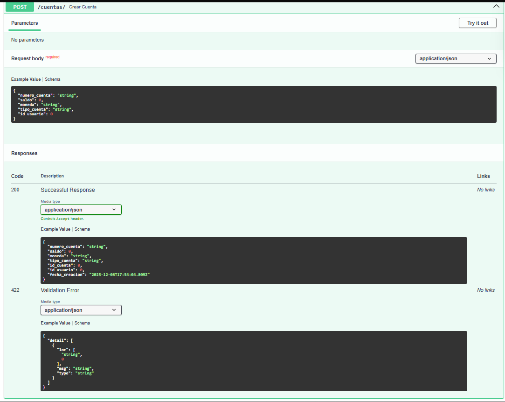

*Imagen C1: Endpoints completos para la gestión de cuentas bancarias. Permite crear, listar, consultar, actualizar y eliminar cuentas. Incluye funcionalidades especiales como agregar saldo a una cuenta, obtener todas las cuentas del usuario autenticado y consultar el historial de movimientos (depósitos/recargas) de cada cuenta.*

**tarjetas**

- ``GET /tarjetas/`` - Listar Tarjetas 🔒
- ``POST /tarjetas/solicitar`` - Solicitar Tarjeta 🔒
- ``GET /tarjetas/mis`` - Obtener Mis Tarjetas 🔒
- ``PUT /tarjetas/{tarjeta_id}/bloquear`` - Cambiar Estado Tarjeta 🔒
- ``DELETE /tarjetas/{tarjeta_id}`` - Eliminar Tarjeta 🔒
- ``GET /tarjetas/{tarjeta_id}`` - Obtener Tarjeta 🔒
- ``PUT /tarjetas/{tarjeta_id}`` - Actualizar Tarjeta 🔒

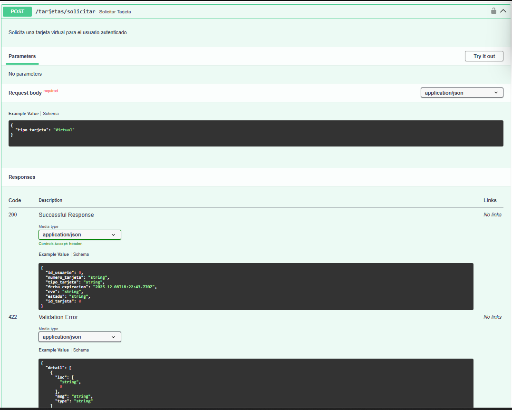

*Imagen T1: Endpoints completos para la gestión de tarjetas virtuales. Permite solicitar nuevas tarjetas, listar todas las tarjetas del sistema, obtener las tarjetas propias del usuario autenticado, consultar detalles de tarjetas específicas, actualizar información, bloquear/desbloquear tarjetas y eliminarlas. Sistema integral para administración de tarjetas de débito/crédito virtuales.*

**transacciones**

- ``POST /transacciones/`` - Crear Transacción 🔒
- ``GET /transacciones/mis`` - Listar Mis Transacciones 🔒
- ``GET /transacciones/usuario/{usuario_id}`` - Listar Transacciones Usuario 🔒
- ``GET /transacciones/{transaccion_id}`` - Obtener Transacción 🔒
- ``PUT /transacciones/{transaccion_id}`` - Actualizar Transacción 🔒
- ``DELETE /transacciones/{transaccion_id}`` - Eliminar Transacción 🔒
- ``POST /transacciones/transferir`` - Transferir Fondos 🔒

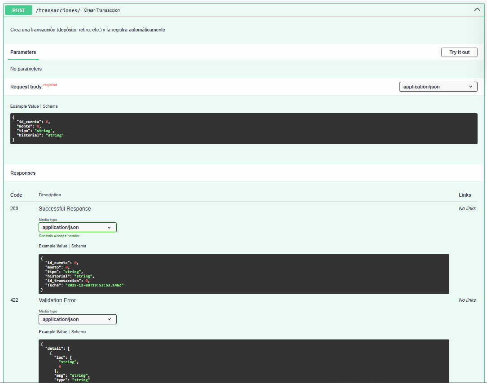

*Imagen TR1: Endpoints completos para la gestión de transacciones financieras. Permite crear transacciones generales, obtener el historial completo de transacciones del usuario autenticado, consultar transacciones de usuarios específicos (para administradores), obtener detalles de transacciones individuales, actualizar información, eliminar transacciones y realizar transferencias de fondos entre cuentas. Sistema integral de seguimiento y administración de movimientos financieros.*

**pagos de servicios**

- ``GET /pagos/`` - Listar Pagos Usuario 🔒
- ``POST /pagos/`` - Crear Pago Servicio 🔒
- ``GET /pagos/metodos-pago`` - Obtener Métodos Pago 🔒
- ``GET /pagos/{pago_id}`` - Obtener Pago Detalle 🔒
- ``PUT /pagos/{pago_id}/confirmar`` - Confirmar Pago Externo 🔒
- ``GET /pagos/estadisticas/usuario`` - Obtener Estadísticas Pagos 🔒

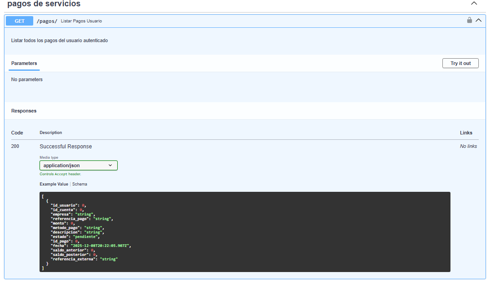

*Imagen P1: Endpoints completos para el sistema de pagos de servicios. Permite listar todos los pagos del usuario, crear nuevos pagos con descuento automático de cartera, obtener los métodos de pago disponibles (cartera, efecty, pse, etc.), consultar detalles de pagos específicos, confirmar pagos externos (Efecty/PSE) y obtener estadísticas de consumo. Sistema integral para gestión de pagos de servicios públicos y privados.*

**soportes**

- ``GET /soportes/`` - Listar Tickets 🔒
- ``POST /soportes/`` - Crear Ticket 🔒
- ``GET /soportes/{ticket_id}`` - Obtener Ticket 🔒
- ``PUT /soportes/{ticket_id}`` - Actualizar Ticket 🔒
- ``DELETE /soportes/{ticket_id}`` - Eliminar Ticket 🔒

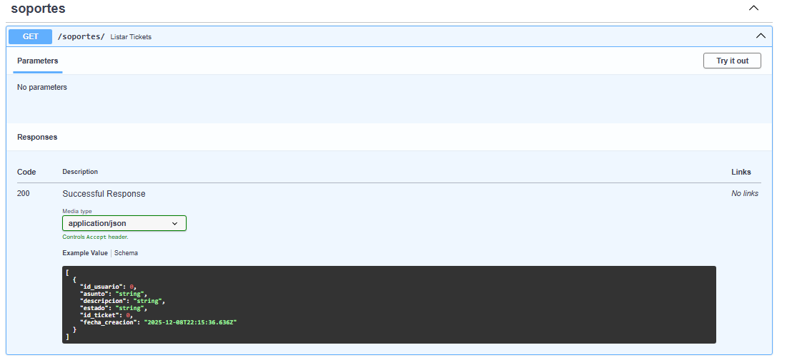

*Imagen SO1: Endpoints completos para el sistema de tickets de soporte. Permite a los usuarios crear tickets de soporte técnico o consultas, listar todos sus tickets, consultar detalles específicos, actualizar el estado o información de tickets y eliminar tickets resueltos. Sistema integral de atención al cliente y soporte técnico para la wallet digital.*

**solicitudes**

- ``POST /solicitudes/crear`` - Crear Solicitud Dinero 🔒
- ``GET /solicitudes/mis-solicitudes`` - Obtener Mis Solicitudes 🔒
- ``GET /solicitudes/recibidas`` - Obtener Solicitudes Recibidas 🔒
- ``POST /solicitudes/{id_solicitud}/aceptar`` - Aceptar Solicitud 🔒
- ``POST /solicitudes/{id_solicitud}/rechazar`` - Rechazar Solicitud 🔒

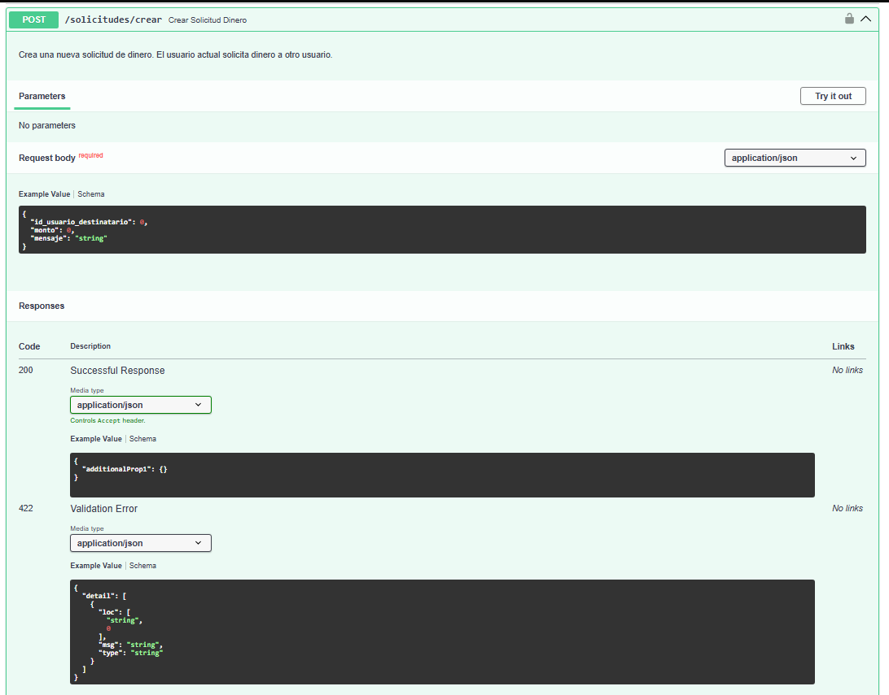

*Imagen SD1: Endpoints completos para el manejo de solicitudes de dinero entre usuarios. Permite crear nuevas solicitudes de dinero especificando destinatario y monto, obtener todas las solicitudes creadas por el usuario actual, ver solicitudes recibidas pendientes de aprobación/rechazo, aceptar solicitudes realizando la transferencia automáticamente y rechazar solicitudes. Sistema integral de solicitudes peer-to-peer.*

**notificaciones**

- ``GET /notificaciones/mis-notificaciones`` - Obtener Mis Notificaciones 🔒
- ``GET /notificaciones/no-leidas/count`` - Contar No Leídas 🔒
- ``PUT /notificaciones/{id_notificacion}/marcar-leida`` - Marcar Como Leída 🔒
- ``PUT /notificaciones/marcar-todas-leidas`` - Marcar Todas Leídas 🔒
- ``DELETE /notificaciones/{id_notificacion}`` - Eliminar Notificación 🔒

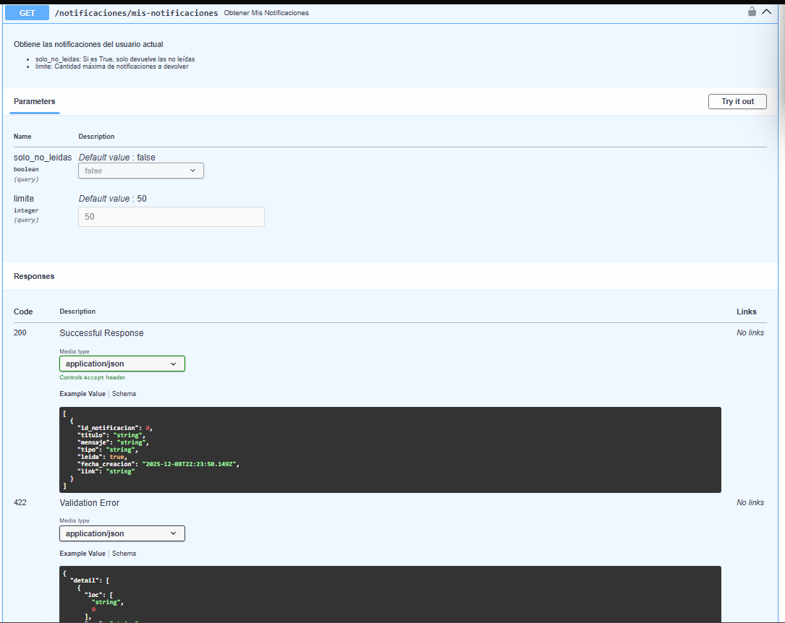

*Imagen NO1: Sistema completo de notificaciones en tiempo real. Permite obtener todas las notificaciones del usuario con opciones de paginación (solo_no_leidas, limite), contar notificaciones no leídas para mostrar badges, marcar notificaciones individuales como leídas, marcar todas como leídas de una vez y eliminar notificaciones específicas. Las notificaciones se generan automáticamente ante eventos importantes como transacciones recibidas, solicitudes de dinero, cambios de estado en cuentas o pagos.*

**categorias**

.. image:: _static/fastapi_9.jpg
   :alt: Endpoints de categorías
   :align: center
   :width: 100%

*Imagen 9: Gestión de categorías para clasificar transacciones. Los usuarios pueden crear categorías personalizadas (Alimentación, Transporte, Entretenimiento, etc.) para organizar mejor sus gastos e ingresos.*

**consentimientos**

- ``POST /consentimientos/registrar`` - Registrar Consentimiento 🔒
- ``GET /consentimientos/mis-consentimientos`` - Obtener Mis Consentimientos 🔒
- ``GET /consentimientos/verificar/{tipo}`` - Verificar Consentimiento 🔒
- ``POST /consentimientos/revocar/{tipo}`` - Revocar Consentimiento 🔒
- ``GET /consentimientos/admin/todos`` - Ver Todos Consentimientos Admin 🔒
- ``GET /consentimientos/admin/estadisticas`` - Estadísticas Consentimientos Admin 🔒

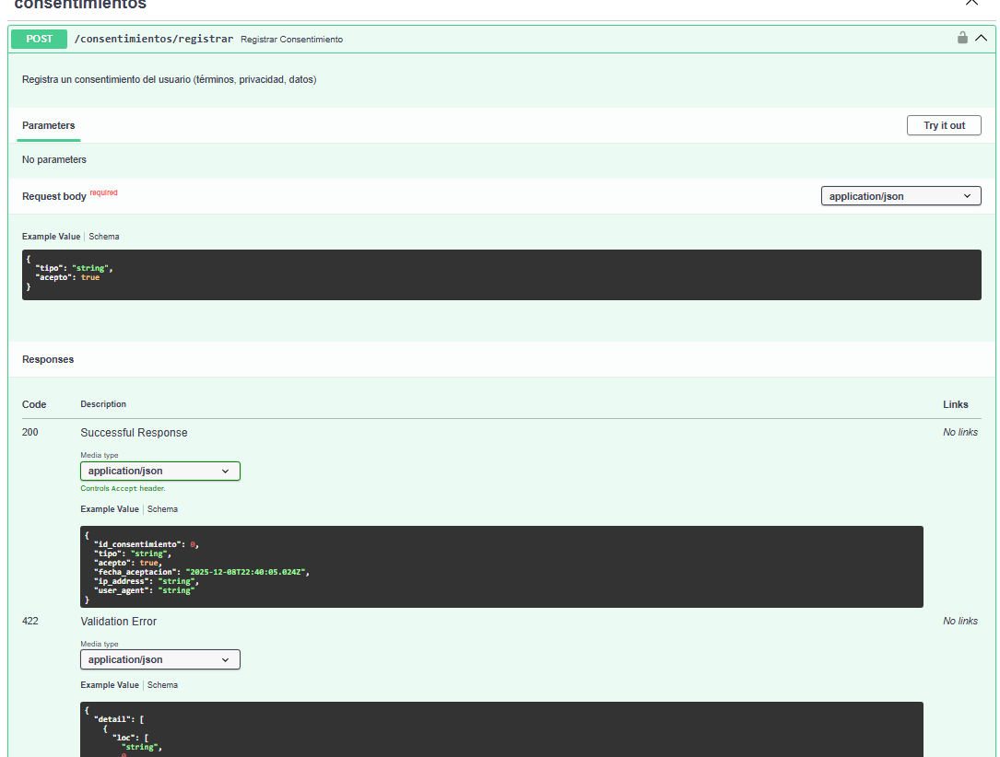

*Imagen CO1: Sistema completo de gestión de consentimientos del usuario (términos, privacidad, datos). Permite registrar nuevos consentimientos del usuario especificando el tipo, obtener todos los consentimientos registrados del usuario actual, verificar si el usuario ha aceptado un tipo específico de consentimiento, revocar un consentimiento aceptado (acepto=False), y endpoints administrativos para ver todos los consentimientos del sistema opcionalmente filtrados por tipo y obtener estadísticas generales de aceptación.*

**solicitudes de eliminación**

- ``POST /usuarios/solicitud-eliminacion`` - Crear Solicitud Eliminación 🔒
- ``GET /usuarios/mis-solicitudes-eliminacion`` - Obtener Mis Solicitudes Eliminación 🔒
- ``DELETE /usuarios/cancelar-solicitud-eliminacion/{id_solicitud}`` - Cancelar Solicitud Eliminación 🔒
- ``GET /usuarios/admin/solicitudes-eliminacion`` - Listar Solicitudes Eliminación Admin 🔒
- ``PUT /usuarios/admin/solicitudes-eliminacion/{id_solicitud}`` - Resolver Solicitud Eliminación Admin 🔒
- ``GET /usuarios/admin/estadisticas-eliminaciones`` - Estadísticas Eliminaciones Admin 🔒

.. image:: _static/fastapi_SE1.png
   :alt: Endpoints de solicitudes de eliminación
   :align: center
   :width: 100%

*Imagen SE1: Sistema completo de solicitudes de eliminación de cuenta (NUEVO SISTEMA). Permite a los usuarios crear solicitudes de eliminación de cuenta proporcionando contraseña, confirmación y razón, obtener el estado de sus solicitudes pendientes, cancelar solicitudes antes de ser procesadas, y endpoints administrativos para listar todas las solicitudes filtradas por estado, aprobar/rechazar solicitudes con comentarios del administrador y obtener estadísticas del sistema de eliminaciones.*

Autenticación
-------------

La API utiliza autenticación Bearer Token (JWT). Para acceder a los endpoints protegidos, debes incluir el token en el header:

.. code-block:: http

   Authorization: Bearer {tu_token_jwt}

Obtener Perfil de Usuario
--------------------------

Endpoint para obtener el perfil completo del usuario autenticado.

.. image:: _static/fastapi_2.jpg
   :alt: Endpoint Actualizar Usuario
   :align: center
   :width: 100%

*Imagen 2: Detalle del endpoint PUT /usuarios/{usuario_id} en Swagger UI. Muestra los parámetros requeridos, el esquema del request body y las posibles respuestas. Permite actualizar información personal del usuario como nombres, apellidos, edad, dirección y documento de identidad.*

**Endpoint:**

.. code-block:: http

   PUT /usuarios/{usuario_id}

**Parámetros de Ruta:**

.. list-table::
   :widths: 20 20 60
   :header-rows: 1

   * - Parámetro
     - Tipo
     - Descripción
   * - usuario_id
     - integer
     - ID del usuario a actualizar (requerido)

**Request Body (application/json):**

.. code-block:: json

   {
     "nombres": "string",
     "apellidos": "string",
     "edad": 0,
     "direccion": "user@example.com",
     "numero_documento": "string",
     "tipo_documento": "string",
     "saldo_total": 0,
     "rol": "string"
   }

**Respuestas:**

- **200 Successful Response** - Usuario actualizado correctamente
- **422 Validation Error** - Error de validación en los datos

**Ejemplo de Respuesta Exitosa:**

.. image:: _static/fastapi_3.jpg
   :alt: Esquema de respuesta UserProfileComplete
   :align: center
   :width: 80%

*Imagen 3: Esquema del modelo UserProfileComplete que define la estructura de datos devuelta al consultar el perfil completo de un usuario. Incluye todos los campos con sus tipos de datos y validaciones correspondientes.*

.. code-block:: json

   {
     "id_usuario": 0,
     "nombres": "string",
     "apellidos": "string",
     "correo": "string",
     "telefono": "string",
     "numero_documento": "string",
     "tipo_documento": "string",
     "saldo_total": 0
   }

Estructura de Datos
-------------------

UserProfileComplete
~~~~~~~~~~~~~~~~~~~

Esquema completo del perfil de usuario.

.. image:: _static/fastapi_10.jpg
   :alt: Schema UserProfileComplete
   :align: center
   :width: 80%

*Imagen 10: Visualización completa del schema UserProfileComplete en Swagger. Muestra la estructura JSON con todos los campos del perfil de usuario, incluyendo tipos de datos, restricciones y valores de ejemplo para cada propiedad.*

.. list-table::
   :widths: 30 20 50
   :header-rows: 1

   * - Campo
     - Tipo
     - Descripción
   * - id_usuario
     - integer
     - Identificador único del usuario
   * - nombres
     - string
     - Nombres del usuario
   * - apellidos
     - string
     - Apellidos del usuario
   * - correo
     - string (email)
     - Correo electrónico del usuario
   * - telefono
     - string | null
     - Número de teléfono (opcional)
   * - numero_documento
     - string
     - Número de documento de identidad
   * - tipo_documento
     - string
     - Tipo de documento (CC, TI, CE, etc.)
   * - saldo_total
     - number
     - Saldo actual en la cuenta

Schemas de Transacciones
~~~~~~~~~~~~~~~~~~~~~~~~~

.. image:: _static/fastapi_11.jpg
   :alt: Schemas de transacciones
   :align: center
   :width: 80%

*Imagen 11: Modelos de datos para transacciones. Define la estructura de TransaccionCreate (para crear nuevas transacciones), TransaccionResponse (respuesta del servidor) y TransaccionFilter (para búsquedas y filtros). Incluye campos como monto, tipo de transacción, usuario origen/destino y categoría.*

Schemas de Solicitudes
~~~~~~~~~~~~~~~~~~~~~~

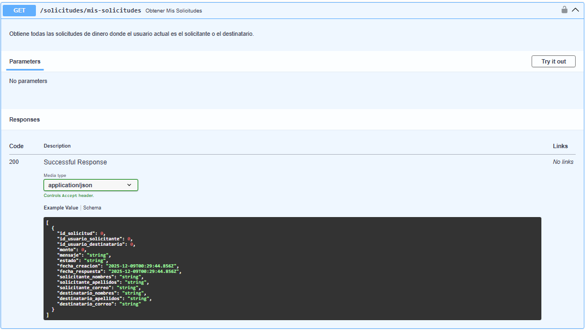

*Imagen SD2: Modelos de datos para el sistema de solicitudes de dinero peer-to-peer. Define la estructura de SolicitudCreate (para crear nuevas solicitudes con campos como id_usuario_destinatario y monto), SolicitudResponse (respuesta del servidor con toda la información incluyendo id_solicitud, id_usuario_solicitante, id_usuario_destinatario, monto, estado, fecha_creacion, fecha_respuesta, solicitante_nombres, solicitante_apellidos, destinatario_nombres y destinatario_correo) y estados (pendiente/aceptada/rechazada).*

Schemas de Notificaciones
~~~~~~~~~~~~~~~~~~~~~~~~~

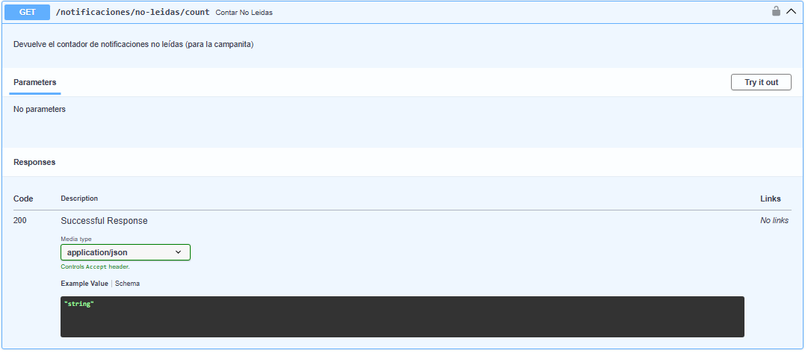

*Imagen NO2: Modelos de datos para el sistema de notificaciones. Define la estructura de NotificacionCreate (para generar nuevas notificaciones con campos como id_notificacion, titulo, mensaje, tipo e is_read), NotificacionResponse (respuesta del servidor con toda la información incluyendo id_notificacion, leida y fecha_creacion) y NotificacionUpdate (para actualizar el estado de lectura). Incluye validación de tipos de notificación y estados de lectura (true/false).*

Schemas de Categorías
~~~~~~~~~~~~~~~~~~~~~

.. image:: _static/fastapi_14.jpg
   :alt: Schemas de categorías
   :align: center
   :width: 80%

*Imagen 14: Estructura de datos para categorías de transacciones. CategoriaCreate y CategoriaResponse incluyen nombre, descripción, icono y color para personalizar la clasificación de gastos e ingresos del usuario.*

Schemas de Consentimientos
~~~~~~~~~~~~~~~~~~~~~~~~~~~

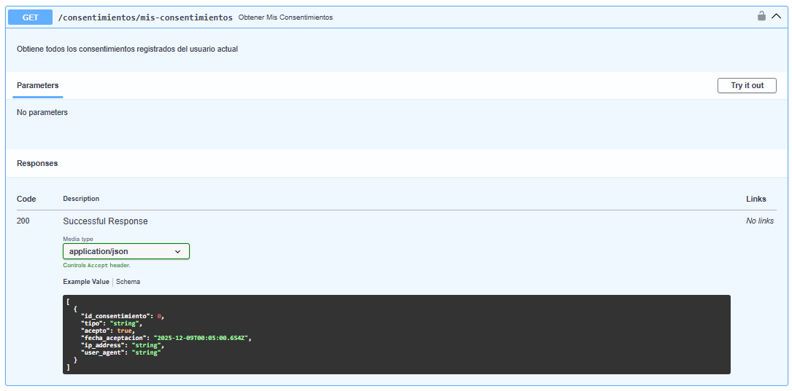

*Imagen CO2: Modelos de datos para el sistema de consentimientos. Define la estructura de ConsentimientoCreate/ConsentimientoRegistrar (para registrar nuevos consentimientos con campos como tipo, acepto, fecha_aceptacion y user_agent), ConsentimientoResponse (respuesta del servidor con toda la información incluyendo id_consentimiento, tipo, acepto, fecha_aceptacion y user_agent) y validaciones de tipos de consentimiento (términos, privacidad, datos).*

Schemas de Solicitudes de Eliminación
~~~~~~~~~~~~~~~~~~~~~~~~~~~~~~~~~~~~~~

.. image:: _static/fastapi_SE2.png
   :alt: Schemas de solicitudes de eliminación
   :align: center
   :width: 80%

*Imagen SE2: Modelos de datos para solicitudes de eliminación de cuenta. Define la estructura de SolicitudEliminacionCreate (para crear nuevas solicitudes con campos como password, confirmacion, razon y fecha_limite), SolicitudEliminacionResponse (respuesta del servidor con toda la información incluyendo id_solicitud, estado, fecha_creacion, fecha_limite y mensaje) y validaciones de estados (pendiente, aprobada, rechazada, cancelada).*

Schemas de Cuentas
~~~~~~~~~~~~~~~~~~

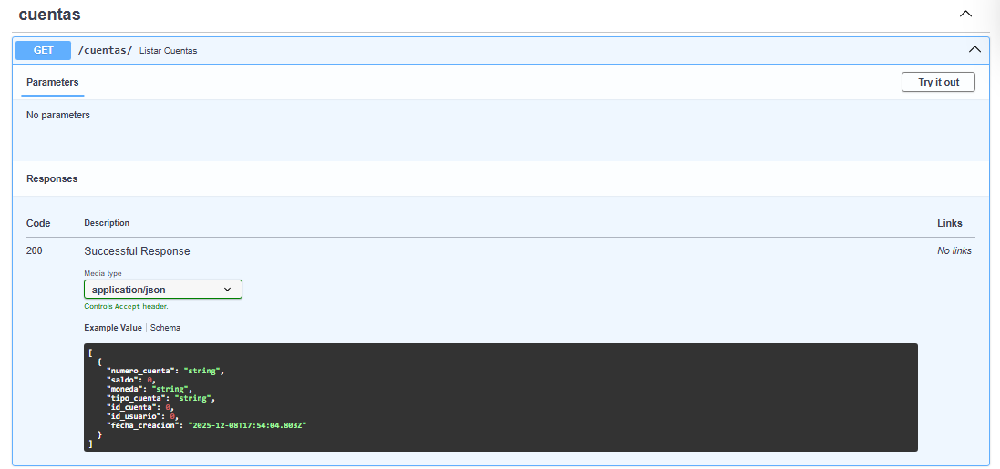

*Imagen C2: Modelos de datos para cuentas bancarias. Define la estructura de CuentaCreate (para registrar nuevas cuentas con campos como numero_cuenta, saldo, moneda y tipo_cuenta), CuentaResponse (respuesta del servidor con toda la información incluyendo id_cuenta, id_usuario y fecha_creacion) y CuentaUpdate (para actualizar información parcial de la cuenta). Incluye validación de tipos de datos y campos requeridos.*

Schemas de Tarjetas
~~~~~~~~~~~~~~~~~~~

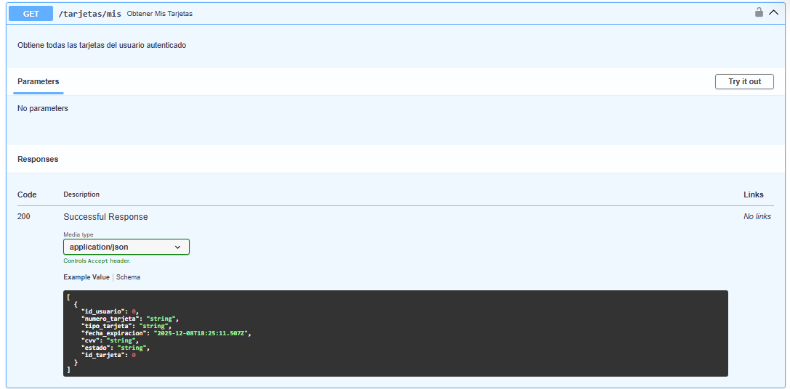

*Imagen T2: Modelos de datos para tarjetas virtuales. Define la estructura de TarjetaCreate/TarjetaSolicitud (para solicitar nuevas tarjetas con campos como id_usuario, numero_tarjeta, tipo_tarjeta, cvv y fecha_expiracion), TarjetaResponse (respuesta del servidor con toda la información incluyendo id_tarjeta, estado y fecha_creacion) y TarjetaUpdate (para actualizar información de la tarjeta). Incluye validación de números de tarjeta, CVV y fechas de expiración.*

Schemas de Transacciones
~~~~~~~~~~~~~~~~~~~~~~~~~

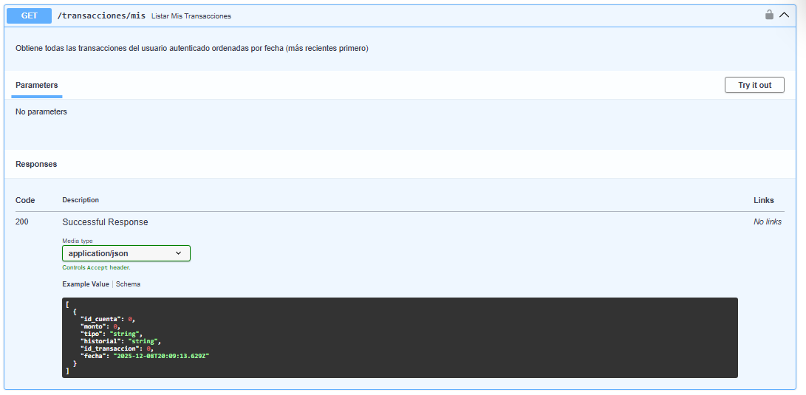

*Imagen TR2: Modelos de datos para transacciones financieras. Define la estructura de TransaccionCreate (para crear nuevas transacciones con campos como id_cuenta, monto, tipo y historial), TransaccionResponse (respuesta del servidor con toda la información incluyendo id_transaccion, id_cuenta, fecha y detalles de la operación) y TransaccionUpdate (para actualizar información de transacciones existentes). Incluye validación de montos, tipos de transacción y referencias a cuentas.*

Schemas de Pagos de Servicios
~~~~~~~~~~~~~~~~~~~~~~~~~~~~~~

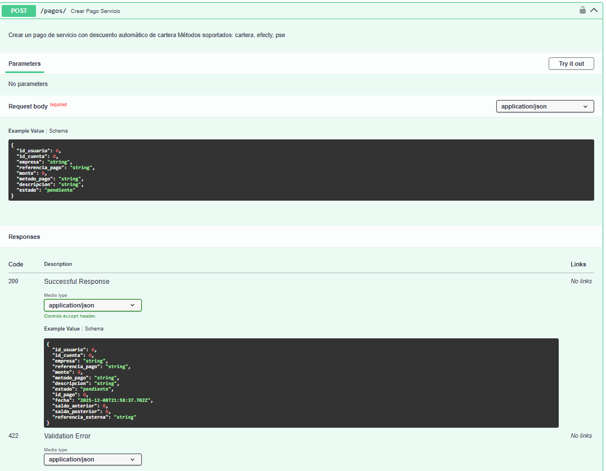

*Imagen P2: Modelos de datos para pagos de servicios. Define la estructura de PagoCreate (para crear nuevos pagos con campos como id_usuario, id_cuenta, empresa, referencia_pago, monto, metodo_pago, descripcion y estado), PagoResponse (respuesta del servidor con toda la información incluyendo id_pago, fecha, saldo_anterior, saldo_posterior y referencia_externa) y PagoUpdate (para actualizar estado de pagos). Incluye validación de métodos de pago soportados (cartera, efecty, pse) y estados (pendiente, confirmado).*

Schemas de Soportes
~~~~~~~~~~~~~~~~~~~

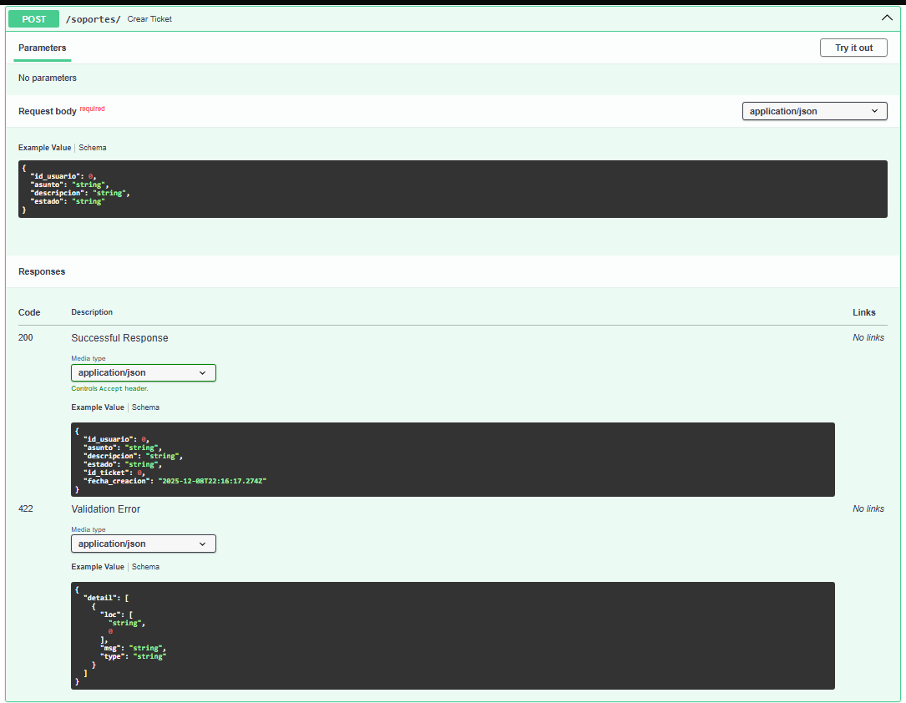

*Imagen SO2: Modelos de datos para tickets de soporte. Define la estructura de TicketCreate/SoporteCreate (para crear nuevos tickets con campos como id_usuario, asunto, descripcion y estado), TicketResponse/SoporteResponse (respuesta del servidor con toda la información incluyendo id_ticket, fecha_creacion y estado del ticket) y TicketUpdate/SoporteUpdate (para actualizar información del ticket). Incluye validación de estados (abierto, en proceso, resuelto, cerrado).*

Ejemplo de Implementación
--------------------------

Registro de Usuario
~~~~~~~~~~~~~~~~~~~

.. image:: _static/fastapi_15.jpg
   :alt: Endpoint de registro
   :align: center
   :width: 100%

*Imagen 15: Endpoint POST /usuarios/registro en acción. Muestra la interfaz de Swagger para crear nuevos usuarios con validación de campos obligatorios (nombres, apellidos, correo, documento) y opcionales (teléfono). La contraseña se encripta automáticamente antes de guardarse en la base de datos.*

.. code-block:: bash

   curl -X POST "http://localhost:8000/usuarios/registro" \
     -H "Content-Type: application/json" \
     -d '{
       "nombres": "Juan",
       "apellidos": "Pérez",
       "correo": "juan@example.com",
       "telefono": "3001234567",
       "numero_documento": "1234567890",
       "tipo_documento": "CC",
       "contraseña": "MiPassword123!"
     }'

Login
~~~~~

.. image:: _static/fastapi_16.jpg
   :alt: Endpoint de login
   :align: center
   :width: 100%

*Imagen 16: Endpoint POST /usuarios/login-json para autenticación. Valida credenciales (correo y contraseña) y retorna un token JWT de acceso que debe incluirse en las peticiones subsecuentes a endpoints protegidos. El token tiene una expiración configurable.*

.. code-block:: bash

   curl -X POST "http://localhost:8000/usuarios/login-json" \
     -H "Content-Type: application/json" \
     -d '{
       "correo": "juan@example.com",
       "contraseña": "MiPassword123!"
     }'

Obtener Mi Perfil
~~~~~~~~~~~~~~~~~

.. image:: _static/fastapi_17.jpg
   :alt: Endpoint obtener mi perfil
   :align: center
   :width: 100%

*Imagen 17: Endpoint GET /usuarios/me que retorna la información del usuario autenticado. Requiere token JWT en el header Authorization. Devuelve datos básicos del perfil sin información sensible como la contraseña.*

.. code-block:: bash

   curl -X GET "http://localhost:8000/usuarios/me" \
     -H "Authorization: Bearer {tu_token_jwt}"

Actualizar Usuario
~~~~~~~~~~~~~~~~~~

.. image:: _static/fastapi_18.jpg
   :alt: Endpoint actualizar usuario
   :align: center
   :width: 100%

*Imagen 18: Endpoint PUT /usuarios/{usuario_id} para modificar datos del perfil. Solo el usuario propietario o administradores pueden actualizar la información. Acepta actualizaciones parciales (no es necesario enviar todos los campos).*

.. code-block:: bash

   curl -X PUT "http://localhost:8000/usuarios/1" \
     -H "Authorization: Bearer {tu_token_jwt}" \
     -H "Content-Type: application/json" \
     -d '{
       "nombres": "Juan Carlos",
       "apellidos": "Pérez García",
       "telefono": "3009876543"
     }'

Crear Transacción
~~~~~~~~~~~~~~~~~

.. image:: _static/fastapi_19.jpg
   :alt: Endpoint crear transacción
   :align: center
   :width: 100%

*Imagen 19: Endpoint para realizar transferencias de dinero entre usuarios. Valida saldo suficiente, actualiza los saldos de ambos usuarios automáticamente y registra la transacción con todos sus detalles (fecha, hora, monto, tipo, categoría). Genera notificaciones para ambas partes.*

Crear Solicitud de Dinero
~~~~~~~~~~~~~~~~~~~~~~~~~~

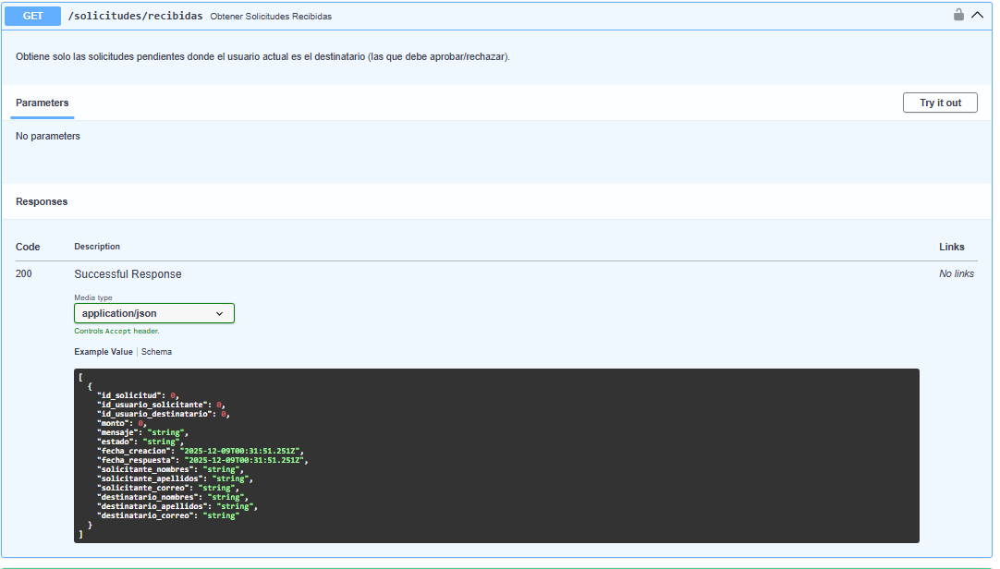

*Imagen SD3: Endpoint POST /solicitudes/crear para crear una nueva solicitud de dinero. El usuario actual solicita dinero a otro usuario. Requiere autenticación y acepta un request body con id_usuario_destinatario (ID del usuario al que se le solicita) y monto (cantidad solicitada). Genera automáticamente una notificación al destinatario y retorna un objeto con los IDs adicionales.*

.. code-block:: bash

   curl -X POST "http://localhost:8000/solicitudes/crear" \
     -H "Authorization: Bearer {tu_token_jwt}" \
     -H "Content-Type: application/json" \
     -d '{
       "id_usuario_destinatario": 0,
       "monto": 0,
       "mensaje": "string"
     }'

Obtener Mis Solicitudes
~~~~~~~~~~~~~~~~~~~~~~~~

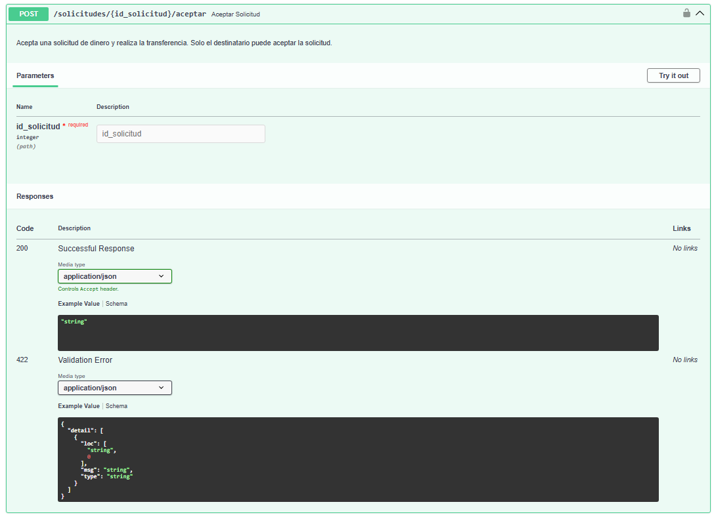

*Imagen SD4: Endpoint GET /solicitudes/mis-solicitudes que retorna todas las solicitudes de dinero creadas por el usuario autenticado (donde el usuario es el solicitante). No requiere parámetros. Muestra el historial completo con información del destinatario, monto, estado, fechas de creación y respuesta, nombres completos y correo.*

.. code-block:: bash

   curl -X GET "http://localhost:8000/solicitudes/mis-solicitudes" \
     -H "Authorization: Bearer {tu_token_jwt}"

Obtener Solicitudes Recibidas
~~~~~~~~~~~~~~~~~~~~~~~~~~~~~~

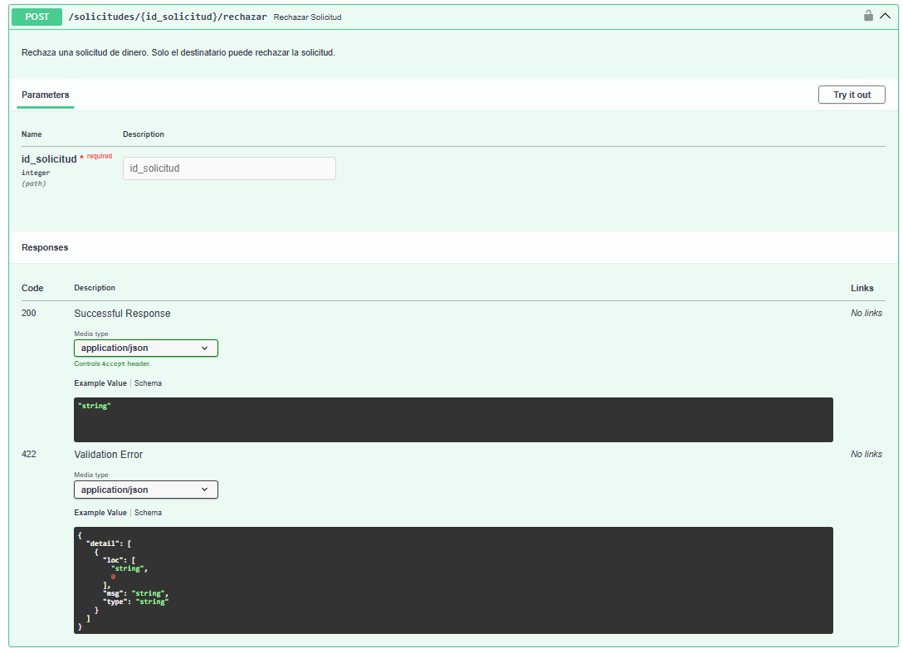

*Imagen SD5: Endpoint GET /solicitudes/recibidas que retorna solo las solicitudes pendientes donde el usuario autenticado es el destinatario (las que debe aprobar/rechazar). No requiere parámetros. Filtra automáticamente solo solicitudes en estado pendiente que requieren acción del usuario.*

.. code-block:: bash

   curl -X GET "http://localhost:8000/solicitudes/recibidas" \
     -H "Authorization: Bearer {tu_token_jwt}"

Aceptar Solicitud
~~~~~~~~~~~~~~~~~

.. image:: _static/fastapi_SD6.png
   :alt: Endpoint aceptar solicitud
   :align: center
   :width: 100%

*Imagen SD6: Endpoint POST /solicitudes/{id_solicitud}/aceptar para aceptar una solicitud de dinero y realizar la transferencia. Solo el destinatario puede aceptarla. Requiere el ID de la solicitud como parámetro de ruta. Valida saldo suficiente, realiza la transferencia automáticamente, actualiza el estado a "aceptada" y genera notificaciones.*

.. code-block:: bash

   curl -X POST "http://localhost:8000/solicitudes/1/aceptar" \
     -H "Authorization: Bearer {tu_token_jwt}"

Rechazar Solicitud
~~~~~~~~~~~~~~~~~~

.. image:: _static/fastapi_SD7.png
   :alt: Endpoint rechazar solicitud
   :align: center
   :width: 100%

*Imagen SD7: Endpoint POST /solicitudes/{id_solicitud}/rechazar para rechazar una solicitud de dinero. Solo el destinatario puede rechazarla. Requiere el ID de la solicitud como parámetro de ruta. Actualiza el estado a "rechazada", registra la fecha de respuesta y notifica al solicitante.*

.. code-block:: bash

   curl -X POST "http://localhost:8000/solicitudes/1/rechazar" \
     -H "Authorization: Bearer {tu_token_jwt}"

Obtener Mis Notificaciones
~~~~~~~~~~~~~~~~~~~~~~~~~~~

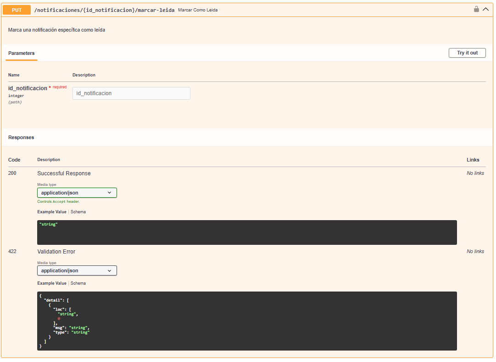

*Imagen NO3: Endpoint GET /notificaciones/mis-notificaciones que retorna todas las notificaciones del usuario autenticado. Acepta parámetros opcionales: solo_no_leidas (boolean, default: false) para filtrar solo notificaciones no leídas, y limite (integer, default: 50) para paginación. Muestra todas las notificaciones ordenadas por fecha con información completa: título, mensaje, tipo, estado de lectura y fecha de creación.*

.. code-block:: bash

   curl -X GET "http://localhost:8000/notificaciones/mis-notificaciones?solo_no_leidas=false&limite=50" \
     -H "Authorization: Bearer {tu_token_jwt}"

Contar Notificaciones No Leídas
~~~~~~~~~~~~~~~~~~~~~~~~~~~~~~~~

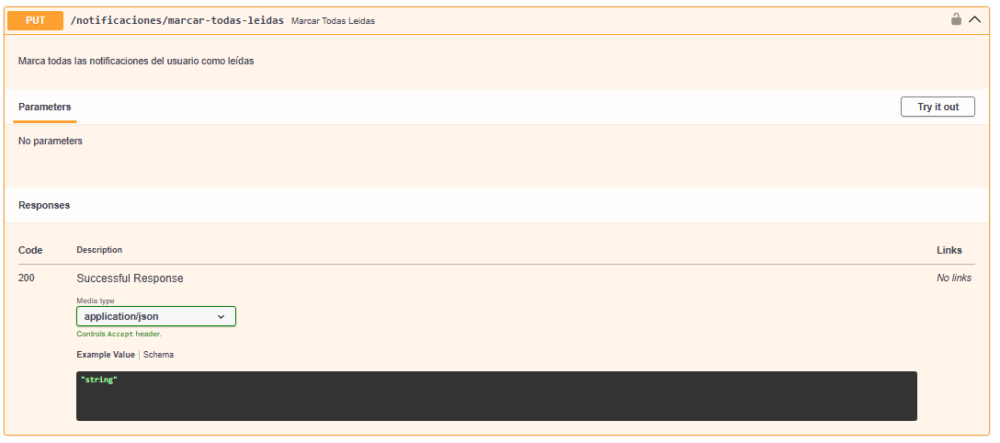

*Imagen NO4: Endpoint GET /notificaciones/no-leidas/count que devuelve el contador de notificaciones no leídas del usuario (para mostrar en badges o iconos de campana). No requiere parámetros. Retorna un valor string con el número total de notificaciones pendientes de leer. Útil para actualizar indicadores en tiempo real.*

.. code-block:: bash

   curl -X GET "http://localhost:8000/notificaciones/no-leidas/count" \
     -H "Authorization: Bearer {tu_token_jwt}"

Marcar Notificación Como Leída
~~~~~~~~~~~~~~~~~~~~~~~~~~~~~~~

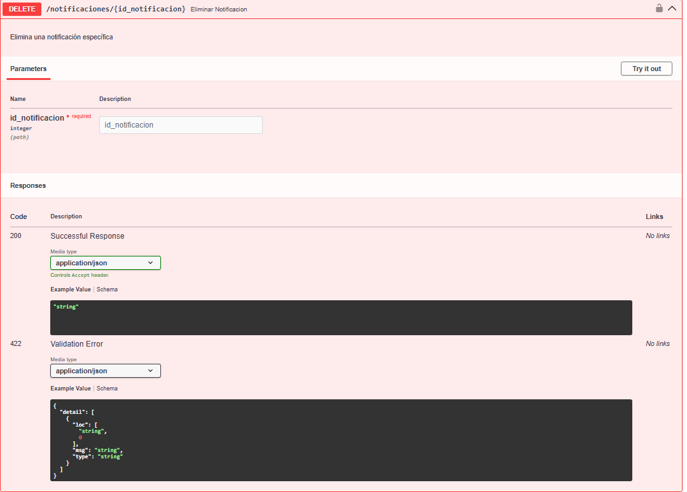

*Imagen NO5: Endpoint PUT /notificaciones/{id_notificacion}/marcar-leida para marcar una notificación específica como leída. Requiere el ID de la notificación como parámetro de ruta. Actualiza el estado de is_read/leida a true. Retorna mensaje de confirmación. Solo el propietario puede marcar sus notificaciones.*

.. code-block:: bash

   curl -X PUT "http://localhost:8000/notificaciones/1/marcar-leida" \
     -H "Authorization: Bearer {tu_token_jwt}"

Gestión de Categorías
~~~~~~~~~~~~~~~~~~~~~

.. image:: _static/fastapi_22.jpg
   :alt: Endpoint gestión de categorías
   :align: center
   :width: 100%

*Imagen 22: Endpoints CRUD completos para categorías de transacciones. Los usuarios pueden crear categorías personalizadas, modificarlas, eliminarlas y listarlas. Cada categoría puede tener nombre, descripción, icono y color para mejor visualización en dashboards y reportes.*

Registrar Consentimiento
~~~~~~~~~~~~~~~~~~~~~~~~

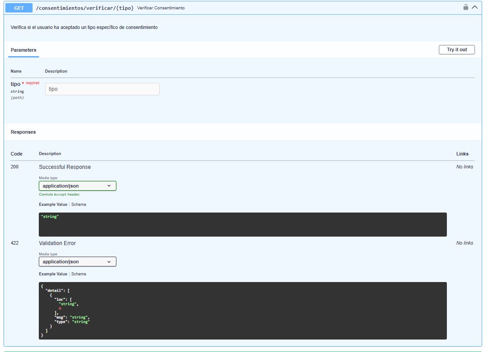

*Imagen CO3: Endpoint POST /consentimientos/registrar para registrar un nuevo consentimiento del usuario (términos, privacidad, datos). Requiere autenticación y acepta un request body con campos tipo (string) y acepto (boolean: true). El sistema registra automáticamente la fecha de aceptación y el user_agent. Útil para cumplimiento legal y trazabilidad.*

.. code-block:: bash

   curl -X POST "http://localhost:8000/consentimientos/registrar" \
     -H "Authorization: Bearer {tu_token_jwt}" \
     -H "Content-Type: application/json" \
     -d '{
       "tipo": "string",
       "acepto": true
     }'

Obtener Mis Consentimientos
~~~~~~~~~~~~~~~~~~~~~~~~~~~~

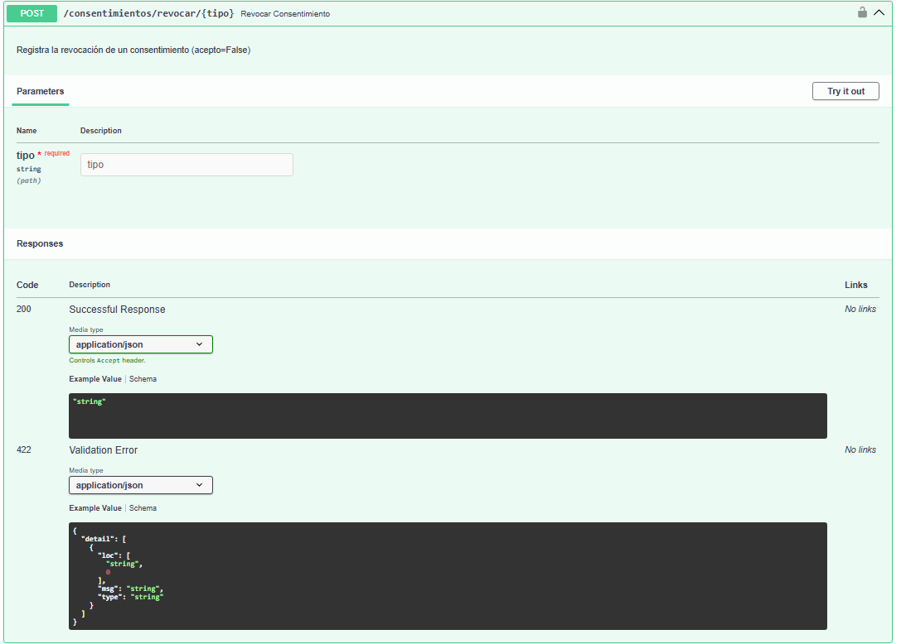

*Imagen CO4: Endpoint GET /consentimientos/mis-consentimientos que retorna todos los consentimientos registrados del usuario autenticado. No requiere parámetros. Muestra el historial completo de consentimientos con tipo, estado de aceptación, fecha de aceptación y user_agent utilizado.*

.. code-block:: bash

   curl -X GET "http://localhost:8000/consentimientos/mis-consentimientos" \
     -H "Authorization: Bearer {tu_token_jwt}"

Verificar Consentimiento
~~~~~~~~~~~~~~~~~~~~~~~~

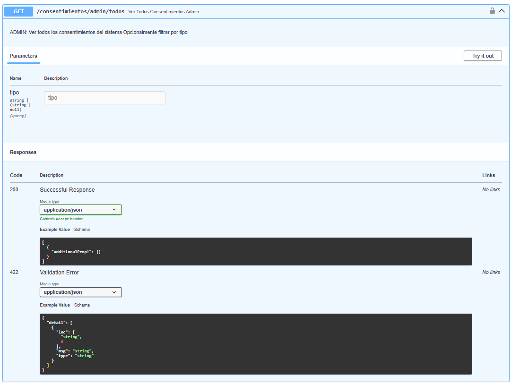

*Imagen CO5: Endpoint GET /consentimientos/verificar/{tipo} para verificar si el usuario ha aceptado un tipo específico de consentimiento. Requiere el tipo como parámetro de ruta. Retorna un valor string indicando si el consentimiento está aceptado. Útil para validaciones antes de procesar datos sensibles.*

.. code-block:: bash

   curl -X GET "http://localhost:8000/consentimientos/verificar/terminos" \
     -H "Authorization: Bearer {tu_token_jwt}"

Revocar Consentimiento
~~~~~~~~~~~~~~~~~~~~~~

.. image:: _static/fastapi_CO6.png
   :alt: Endpoint revocar consentimiento
   :align: center
   :width: 100%

*Imagen CO6: Endpoint POST /consentimientos/revocar/{tipo} para revocar un consentimiento previamente aceptado (acepto=False). Requiere el tipo como parámetro de ruta. Registra la revocación manteniendo el historial. Permite a los usuarios ejercer su derecho de retractación en cualquier momento.*

.. code-block:: bash

   curl -X POST "http://localhost:8000/consentimientos/revocar/privacidad" \
     -H "Authorization: Bearer {tu_token_jwt}"

Crear Solicitud de Eliminación
~~~~~~~~~~~~~~~~~~~~~~~~~~~~~~~

.. image:: _static/fastapi_SE3.png
   :alt: Endpoint crear solicitud eliminación
   :align: center
   :width: 100%

*Imagen SE3: Endpoint POST /usuarios/solicitud-eliminacion para crear una nueva solicitud de eliminación de cuenta (NUEVO SISTEMA). Requiere autenticación y un request body con password (contraseña del usuario), confirmacion (string de confirmación) y razon (motivo de eliminación). Los administradores deben aprobar la solicitud antes de eliminar la cuenta definitivamente.*

.. code-block:: bash

   curl -X POST "http://localhost:8000/usuarios/solicitud-eliminacion" \
     -H "Authorization: Bearer {tu_token_jwt}" \
     -H "Content-Type: application/json" \
     -d '{
       "password": "string",
       "confirmacion": "string",
       "razon": "string"
     }'

Obtener Mis Solicitudes de Eliminación
~~~~~~~~~~~~~~~~~~~~~~~~~~~~~~~~~~~~~~~

.. image:: _static/fastapi_SE4.png
   :alt: Endpoint obtener mis solicitudes eliminación
   :align: center
   :width: 100%

*Imagen SE4: Endpoint GET /usuarios/mis-solicitudes-eliminacion que retorna todas las solicitudes de eliminación del usuario autenticado. No requiere parámetros. Muestra el estado actual de cada solicitud (pendiente/aprobada/rechazada/cancelada), fechas, razón y comentarios del administrador si los hay.*

.. code-block:: bash

   curl -X GET "http://localhost:8000/usuarios/mis-solicitudes-eliminacion" \
     -H "Authorization: Bearer {tu_token_jwt}"

Cancelar Solicitud de Eliminación
~~~~~~~~~~~~~~~~~~~~~~~~~~~~~~~~~~

.. image:: _static/fastapi_SE5.png
   :alt: Endpoint cancelar solicitud eliminación
   :align: center
   :width: 100%

*Imagen SE5: Endpoint DELETE /usuarios/cancelar-solicitud-eliminacion/{id_solicitud} para cancelar una solicitud de eliminación pendiente. Requiere el ID de la solicitud como parámetro de ruta. Solo se pueden cancelar solicitudes en estado pendiente. Retorna mensaje de confirmación.*

.. code-block:: bash

   curl -X DELETE "http://localhost:8000/usuarios/cancelar-solicitud-eliminacion/1" \
     -H "Authorization: Bearer {tu_token_jwt}"

Listar Solicitudes Eliminación Admin
~~~~~~~~~~~~~~~~~~~~~~~~~~~~~~~~~~~~~

.. image:: _static/fastapi_SE6.png
   :alt: Endpoint listar solicitudes eliminación admin
   :align: center
   :width: 100%

*Imagen SE6: Endpoint GET /usuarios/admin/solicitudes-eliminacion para administradores. Lista todas las solicitudes de eliminación del sistema con opción de filtrar por estado mediante query parameter. Útil para gestionar y revisar solicitudes pendientes de aprobación. Solo accesible por administradores.*

.. code-block:: bash

   curl -X GET "http://localhost:8000/usuarios/admin/solicitudes-eliminacion?estado=pendiente" \
     -H "Authorization: Bearer {tu_token_jwt}"

Resolver Solicitud Eliminación Admin
~~~~~~~~~~~~~~~~~~~~~~~~~~~~~~~~~~~~~

.. image:: _static/fastapi_SE7.png
   :alt: Endpoint resolver solicitud eliminación admin
   :align: center
   :width: 100%

*Imagen SE7: Endpoint PUT /usuarios/admin/solicitudes-eliminacion/{id_solicitud} para aprobar o rechazar solicitudes de eliminación. Requiere el ID de la solicitud y un request body con accion ("aprobar"/"rechazar") y comentario opcional del administrador. Al aprobar, se elimina permanentemente la cuenta del usuario. Solo para administradores.*

.. code-block:: bash

   curl -X PUT "http://localhost:8000/usuarios/admin/solicitudes-eliminacion/1" \
     -H "Authorization: Bearer {tu_token_jwt}" \
     -H "Content-Type: application/json" \
     -d '{
       "accion": "string",
       "comentario": "string"
     }'

Estadísticas Eliminaciones Admin
~~~~~~~~~~~~~~~~~~~~~~~~~~~~~~~~~

.. image:: _static/fastapi_SE8.png
   :alt: Endpoint estadísticas eliminaciones admin
   :align: center
   :width: 100%

*Imagen SE8: Endpoint GET /usuarios/admin/estadisticas-eliminaciones para obtener estadísticas del sistema de eliminaciones. No requiere parámetros. Retorna métricas como total de solicitudes por estado, razones más comunes, tendencias temporales y tiempo promedio de resolución. Solo para administradores.*

.. code-block:: bash

   curl -X GET "http://localhost:8000/usuarios/admin/estadisticas-eliminaciones" \
     -H "Authorization: Bearer {tu_token_jwt}"

Crear Cuenta
~~~~~~~~~~~~

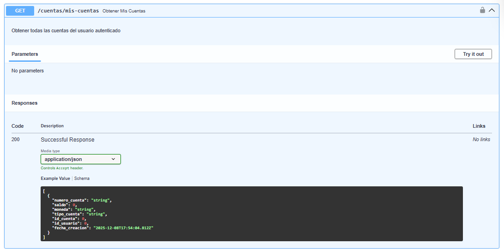

*Imagen C3: Endpoint POST /cuentas/ para registrar una nueva cuenta bancaria. Requiere autenticación y acepta un request body con los campos numero_cuenta (string), saldo (number), moneda (string) y tipo_cuenta (string). El id_usuario se asigna automáticamente del usuario autenticado. Retorna código 200 con los datos de la cuenta creada o 422 en caso de error de validación.*

.. code-block:: bash

   curl -X POST "http://localhost:8000/cuentas/" \
     -H "Authorization: Bearer {tu_token_jwt}" \
     -H "Content-Type: application/json" \
     -d '{
       "numero_cuenta": "1234567890",
       "saldo": 0,
       "moneda": "string",
       "tipo_cuenta": "ahorros",
       "id_usuario": 0
     }'

Obtener Mis Cuentas
~~~~~~~~~~~~~~~~~~~

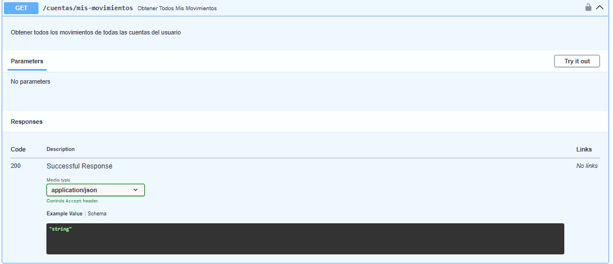

*Imagen C4: Endpoint GET /cuentas/mis-cuentas que retorna todas las cuentas bancarias del usuario autenticado. No requiere parámetros adicionales, solo el token JWT. Útil para mostrar el portafolio completo de cuentas del usuario con sus saldos actuales, números de cuenta y tipos.*

.. code-block:: bash

   curl -X GET "http://localhost:8000/cuentas/mis-cuentas" \
     -H "Authorization: Bearer {tu_token_jwt}"

Actualizar Cuenta
~~~~~~~~~~~~~~~~~

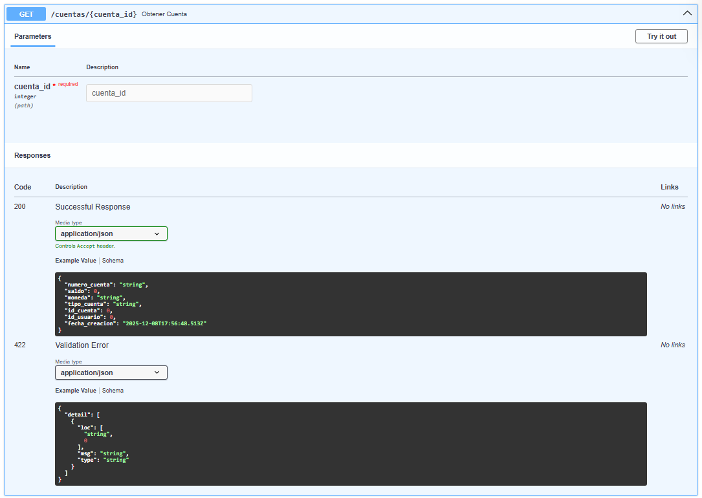

*Imagen C5: Endpoint PUT /cuentas/{cuenta_id} para modificar información de una cuenta existente. Requiere el ID de la cuenta como parámetro de ruta y acepta un request body con los campos a actualizar: numero_cuenta, saldo, moneda y tipo_cuenta. Solo el propietario de la cuenta puede realizar modificaciones.*

.. code-block:: bash

   curl -X PUT "http://localhost:8000/cuentas/1" \
     -H "Authorization: Bearer {tu_token_jwt}" \
     -H "Content-Type: application/json" \
     -d '{
       "numero_cuenta": "string",
       "saldo": 0,
       "moneda": "string",
       "tipo_cuenta": "string",
       "id_usuario": 0
     }'

Eliminar Cuenta
~~~~~~~~~~~~~~~

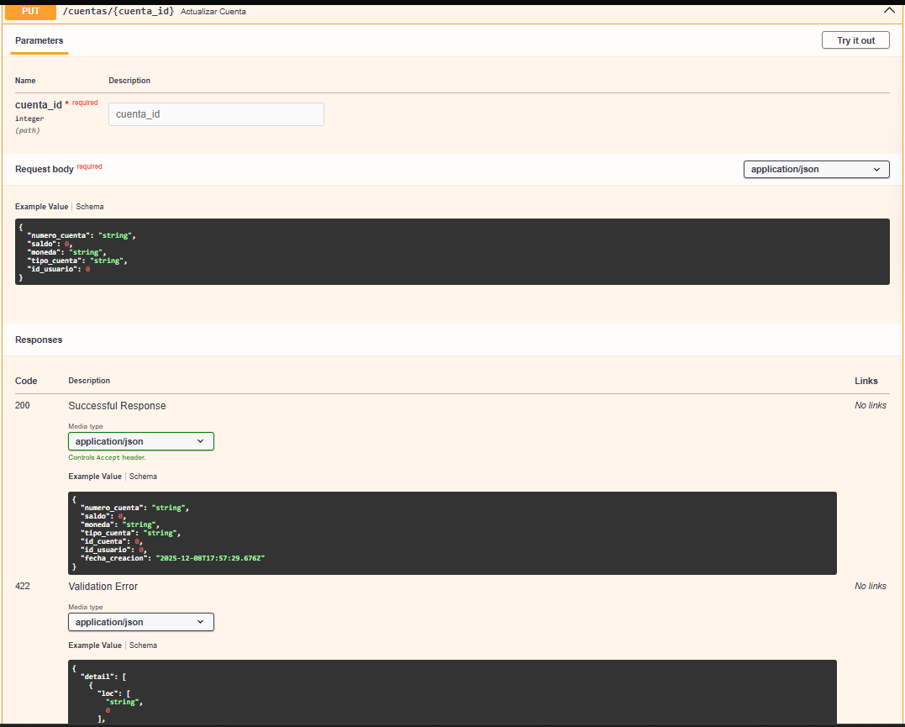

*Imagen C6: Endpoint DELETE /cuentas/{cuenta_id} para eliminar una cuenta bancaria del sistema. Requiere el ID de la cuenta como parámetro de ruta. Retorna un mensaje de confirmación en formato string. Solo permite eliminar cuentas propias del usuario autenticado.*

.. code-block:: bash

   curl -X DELETE "http://localhost:8000/cuentas/1" \
     -H "Authorization: Bearer {tu_token_jwt}"

Agregar Saldo
~~~~~~~~~~~~~

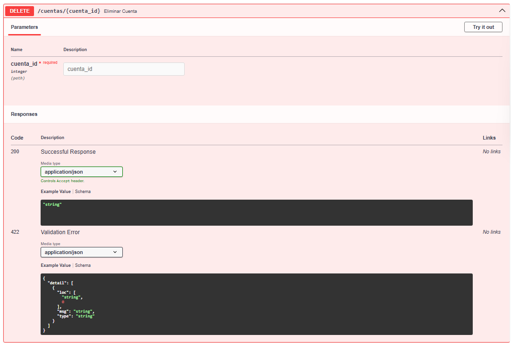

*Imagen C7: Endpoint POST /cuentas/{cuenta_id}/agregar-saldo para depositar o recargar saldo a una cuenta específica. Requiere el ID de la cuenta como parámetro de ruta y un monto en el request body. Esta operación simula un depósito o recarga y registra el movimiento en el historial de la cuenta.*

.. code-block:: bash

   curl -X POST "http://localhost:8000/cuentas/1/agregar-saldo" \
     -H "Authorization: Bearer {tu_token_jwt}" \
     -H "Content-Type: application/json" \
     -d '{
       "monto": 0
     }'

Obtener Todos Mis Movimientos
~~~~~~~~~~~~~~~~~~~~~~~~~~~~~~

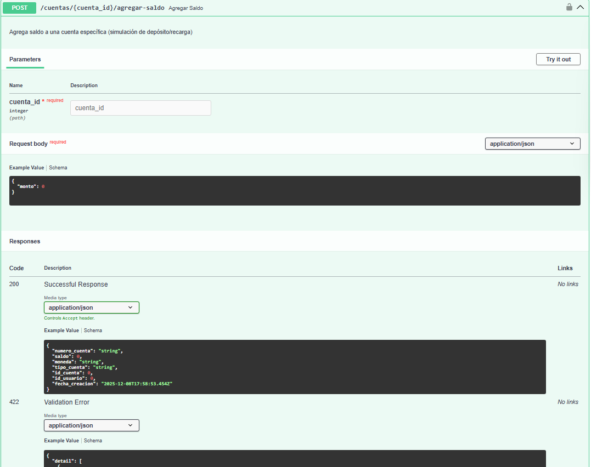

*Imagen C8: Endpoint GET /cuentas/mis-movimientos que retorna el historial completo de todos los movimientos (depósitos/recargas) de todas las cuentas del usuario autenticado. Útil para tener una vista consolidada de todas las operaciones realizadas en las diferentes cuentas.*

.. code-block:: bash

   curl -X GET "http://localhost:8000/cuentas/mis-movimientos" \
     -H "Authorization: Bearer {tu_token_jwt}"

Obtener Movimientos de Cuenta
~~~~~~~~~~~~~~~~~~~~~~~~~~~~~~

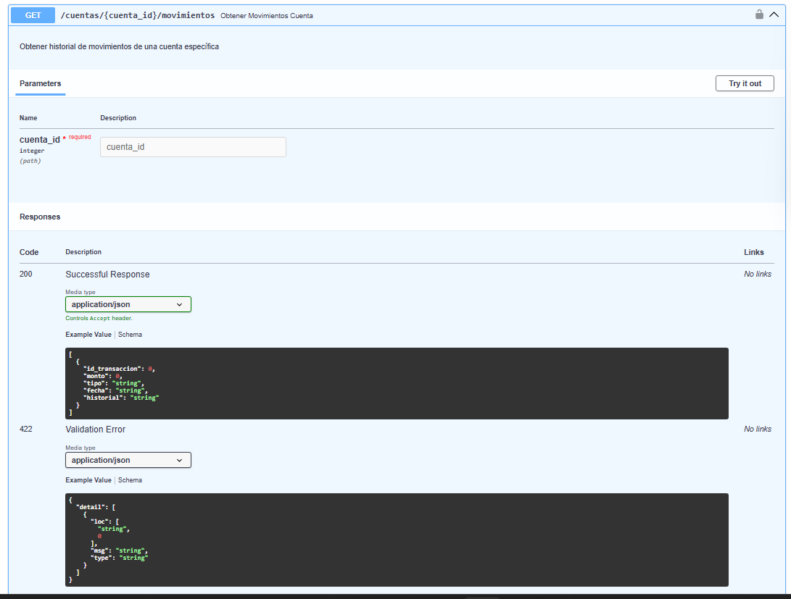

*Imagen C9: Endpoint GET /cuentas/{cuenta_id}/movimientos que obtiene el historial de movimientos específico de una cuenta en particular. Requiere el ID de la cuenta como parámetro de ruta. Muestra todas las operaciones de depósito/recarga realizadas en esa cuenta con detalles como monto, tipo, fecha y descripción.*

.. code-block:: bash

   curl -X GET "http://localhost:8000/cuentas/1/movimientos" \
     -H "Authorization: Bearer {tu_token_jwt}"

Solicitar Tarjeta
~~~~~~~~~~~~~~~~~

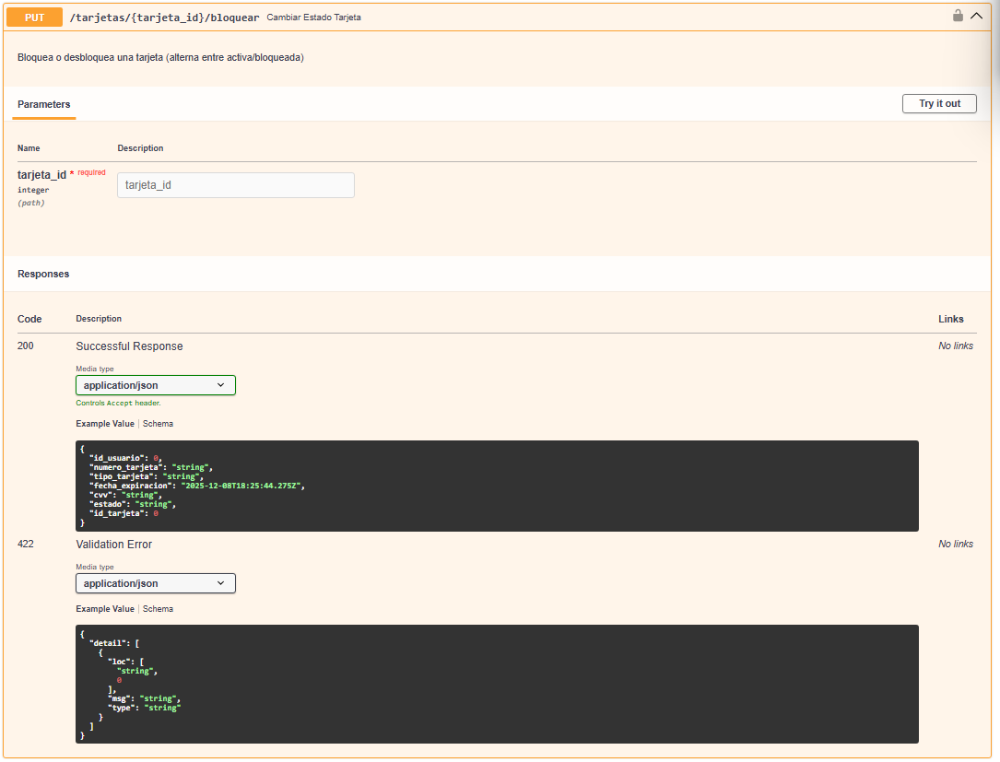

*Imagen T3: Endpoint POST /tarjetas/solicitar para solicitar una nueva tarjeta virtual. Requiere autenticación y acepta un request body con el campo tipo_tarjeta (tipo de tarjeta: "Virtual" u otro). El sistema genera automáticamente el número de tarjeta, CVV, fecha de expiración y asigna el id_usuario del usuario autenticado. Retorna código 200 con los datos de la tarjeta creada.*

.. code-block:: bash

   curl -X POST "http://localhost:8000/tarjetas/solicitar" \
     -H "Authorization: Bearer {tu_token_jwt}" \
     -H "Content-Type: application/json" \
     -d '{
       "tipo_tarjeta": "Virtual"
     }'

Obtener Mis Tarjetas
~~~~~~~~~~~~~~~~~~~~

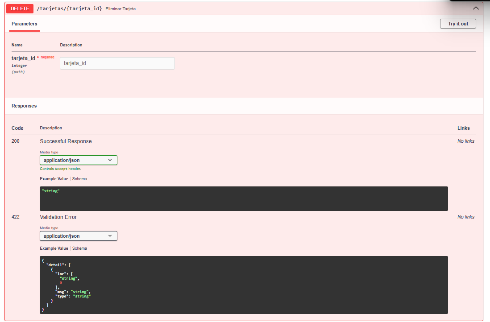

*Imagen T4: Endpoint GET /tarjetas/mis que retorna todas las tarjetas virtuales del usuario autenticado. No requiere parámetros adicionales, solo el token JWT. Muestra información completa de cada tarjeta incluyendo número, tipo, CVV, fecha de expiración y estado (activa/bloqueada). Útil para mostrar el portafolio completo de tarjetas del usuario.*

.. code-block:: bash

   curl -X GET "http://localhost:8000/tarjetas/mis" \
     -H "Authorization: Bearer {tu_token_jwt}"

Bloquear/Desbloquear Tarjeta
~~~~~~~~~~~~~~~~~~~~~~~~~~~~~

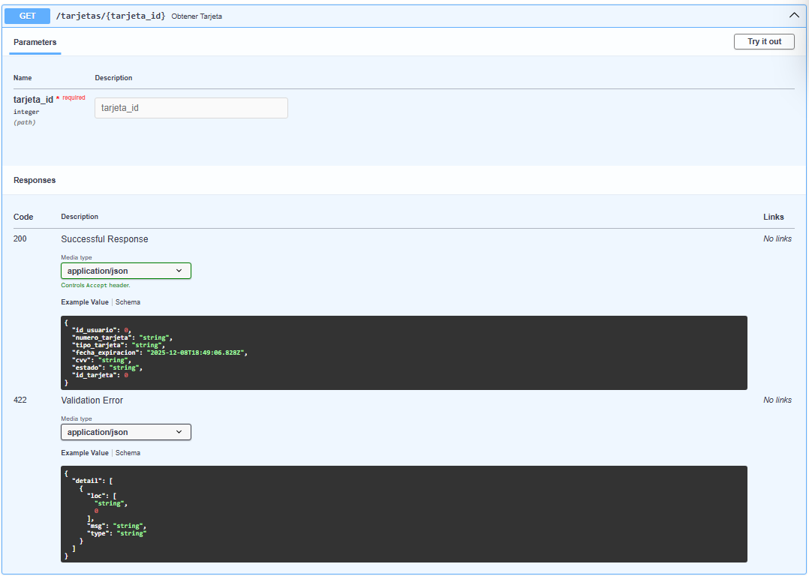

*Imagen T5: Endpoint PUT /tarjetas/{tarjeta_id}/bloquear para cambiar el estado de una tarjeta (alternar entre activa/bloqueada). Requiere el ID de la tarjeta como parámetro de ruta. Permite a los usuarios bloquear temporalmente sus tarjetas por seguridad y desbloquearlas cuando lo necesiten. Solo el propietario de la tarjeta puede cambiar su estado.*

.. code-block:: bash

   curl -X PUT "http://localhost:8000/tarjetas/1/bloquear" \
     -H "Authorization: Bearer {tu_token_jwt}"

Eliminar Tarjeta
~~~~~~~~~~~~~~~~

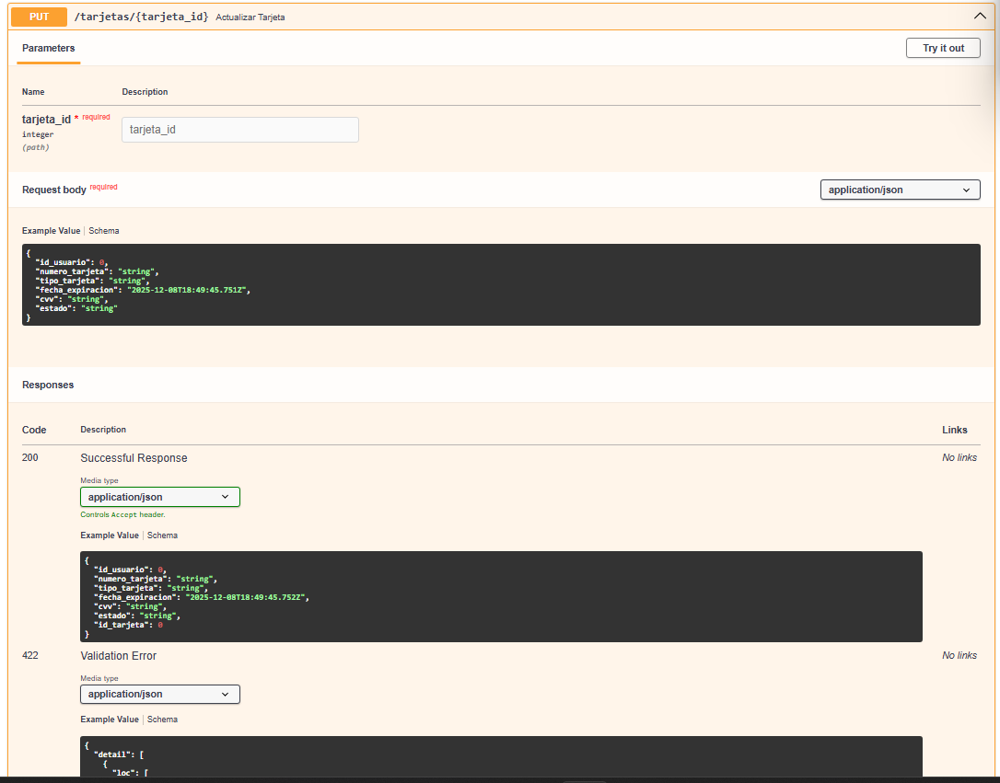

*Imagen T6: Endpoint DELETE /tarjetas/{tarjeta_id} para eliminar permanentemente una tarjeta virtual del sistema. Requiere el ID de la tarjeta como parámetro de ruta. Retorna un mensaje de confirmación en formato string. Solo permite eliminar tarjetas propias del usuario autenticado.*

.. code-block:: bash

   curl -X DELETE "http://localhost:8000/tarjetas/1" \
     -H "Authorization: Bearer {tu_token_jwt}"

Obtener Tarjeta
~~~~~~~~~~~~~~~

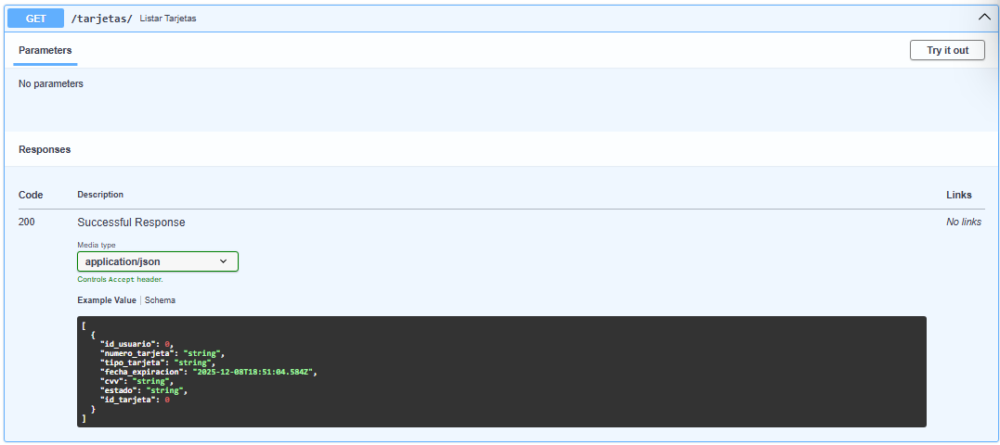

*Imagen T7: Endpoint GET /tarjetas/{tarjeta_id} para consultar los detalles completos de una tarjeta específica. Requiere el ID de la tarjeta como parámetro de ruta. Retorna toda la información de la tarjeta incluyendo número, tipo, CVV, fecha de expiración, estado y datos del usuario propietario. Solo el propietario puede consultar los detalles completos de su tarjeta.*

.. code-block:: bash

   curl -X GET "http://localhost:8000/tarjetas/1" \
     -H "Authorization: Bearer {tu_token_jwt}"

Crear Transacción
~~~~~~~~~~~~~~~~~

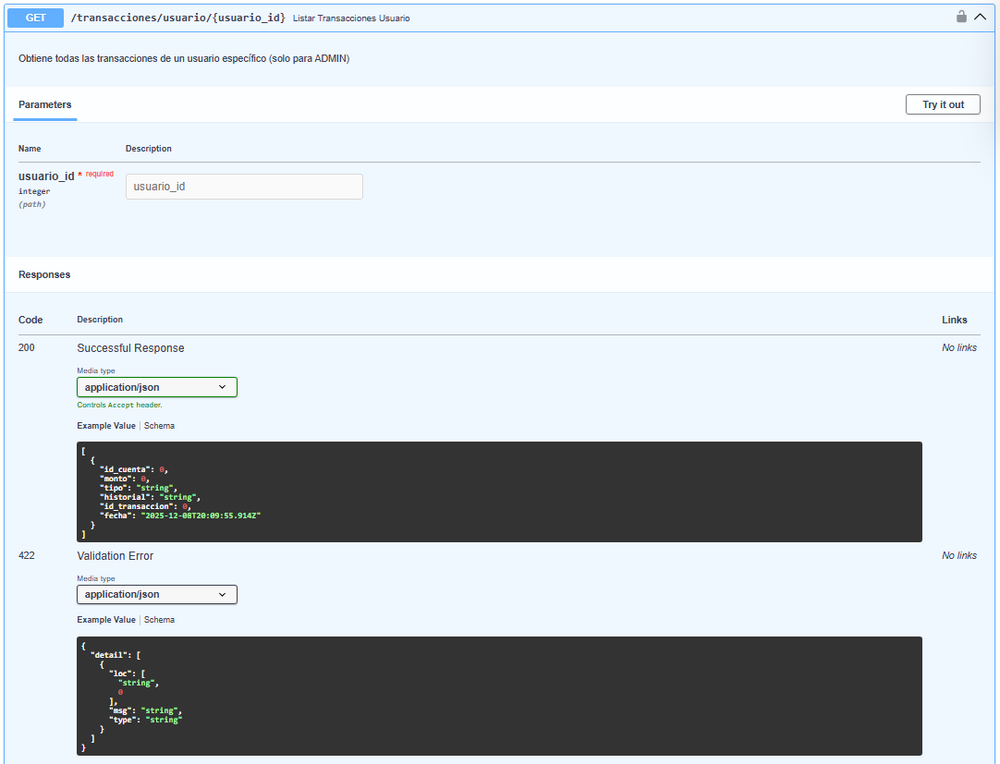

*Imagen TR3: Endpoint POST /transacciones/ para crear una nueva transacción. Requiere autenticación y acepta un request body con los campos id_cuenta (ID de la cuenta), monto (cantidad de la transacción), tipo (tipo de transacción: "Depósito", "Retiro", etc.) y historial (descripción o referencia). El sistema registra automáticamente la fecha y hora de la transacción.*

.. code-block:: bash

   curl -X POST "http://localhost:8000/transacciones/" \
     -H "Authorization: Bearer {tu_token_jwt}" \
     -H "Content-Type: application/json" \
     -d '{
       "id_cuenta": 0,
       "monto": 0,
       "tipo": "string",
       "historial": "string"
     }'

Listar Mis Transacciones
~~~~~~~~~~~~~~~~~~~~~~~~~

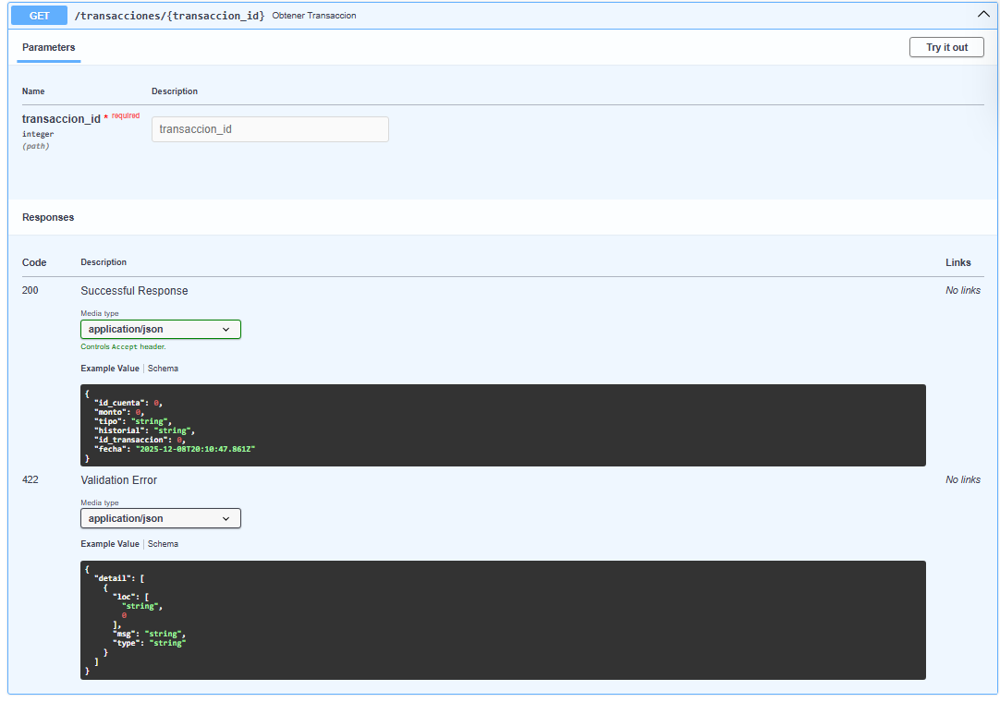

*Imagen TR4: Endpoint GET /transacciones/mis que retorna todas las transacciones del usuario autenticado ordenadas por fecha (más recientes primero). No requiere parámetros adicionales, solo el token JWT. Muestra el historial completo de movimientos incluyendo depósitos, retiros y transferencias con detalles de monto, tipo, cuenta asociada y fecha.*

.. code-block:: bash

   curl -X GET "http://localhost:8000/transacciones/mis" \
     -H "Authorization: Bearer {tu_token_jwt}"

Listar Transacciones de Usuario
~~~~~~~~~~~~~~~~~~~~~~~~~~~~~~~~

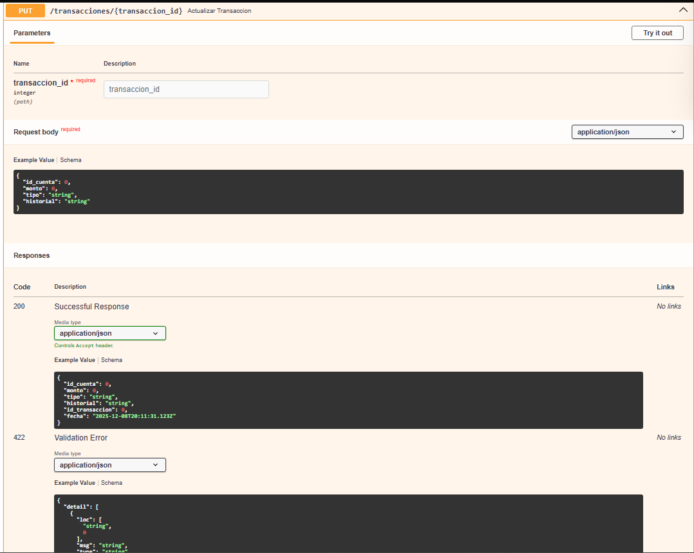

*Imagen TR5: Endpoint GET /transacciones/usuario/{usuario_id} para obtener todas las transacciones de un usuario específico. Requiere el ID del usuario como parámetro de ruta. Útil para administradores que necesitan auditar o revisar el historial financiero de usuarios específicos. Solo accesible por usuarios con permisos de administración.*

.. code-block:: bash

   curl -X GET "http://localhost:8000/transacciones/usuario/1" \
     -H "Authorization: Bearer {tu_token_jwt}"

Obtener Transacción
~~~~~~~~~~~~~~~~~~~

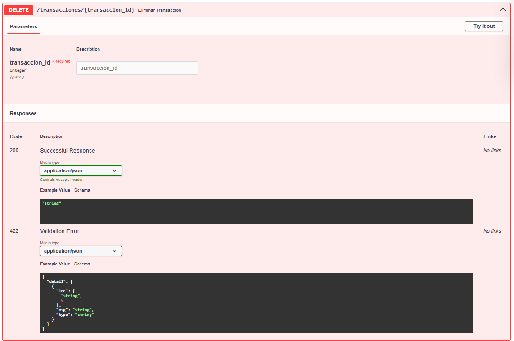

*Imagen TR6: Endpoint GET /transacciones/{transaccion_id} para consultar los detalles completos de una transacción específica. Requiere el ID de la transacción como parámetro de ruta. Retorna toda la información incluyendo monto, tipo, cuenta asociada, historial/descripción y fecha de la operación. Solo el propietario o administradores pueden consultar los detalles.*

.. code-block:: bash

   curl -X GET "http://localhost:8000/transacciones/1" \
     -H "Authorization: Bearer {tu_token_jwt}"

Actualizar Transacción
~~~~~~~~~~~~~~~~~~~~~~

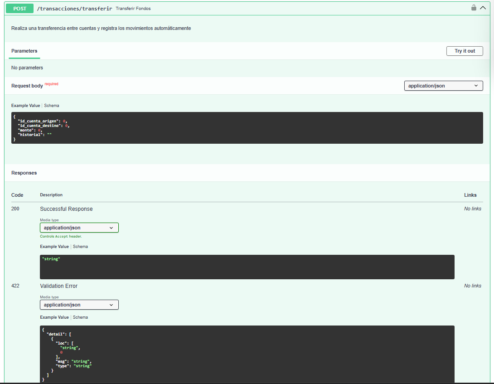

*Imagen TR7: Endpoint PUT /transacciones/{transaccion_id} para modificar información de una transacción existente. Requiere el ID de la transacción como parámetro de ruta y acepta un request body con los campos a actualizar: id_cuenta, monto, tipo e historial. Útil para correcciones o actualizaciones de registros.*

.. code-block:: bash

   curl -X PUT "http://localhost:8000/transacciones/1" \
     -H "Authorization: Bearer {tu_token_jwt}" \
     -H "Content-Type: application/json" \
     -d '{
       "id_cuenta": 0,
       "monto": 0,
       "tipo": "string",
       "historial": "string"
     }'

Crear Pago de Servicio
~~~~~~~~~~~~~~~~~~~~~~~

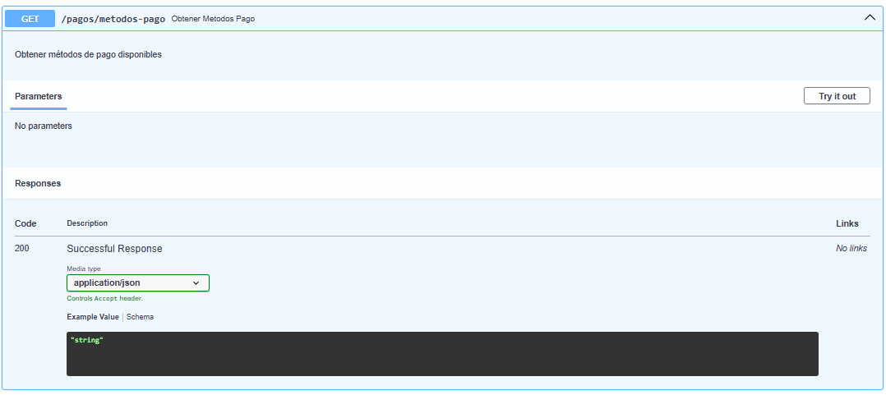

*Imagen P3: Endpoint POST /pagos/ para crear un nuevo pago de servicio con descuento automático de cartera. Requiere autenticación y acepta un request body con campos como id_usuario, id_cuenta, empresa (nombre del servicio), referencia_pago (número de referencia), monto, metodo_pago (cartera/efecty/pse), descripción y estado (pendiente por defecto). El sistema valida saldo, descuenta automáticamente de la cartera y genera referencias para pagos externos.*

.. code-block:: bash

   curl -X POST "http://localhost:8000/pagos/" \
     -H "Authorization: Bearer {tu_token_jwt}" \
     -H "Content-Type: application/json" \
     -d '{
       "id_usuario": 0,
       "id_cuenta": 0,
       "empresa": "string",
       "referencia_pago": "string",
       "monto": 0,
       "metodo_pago": "string",
       "descripcion": "string",
       "estado": "pendiente"
     }'

Listar Pagos del Usuario
~~~~~~~~~~~~~~~~~~~~~~~~~

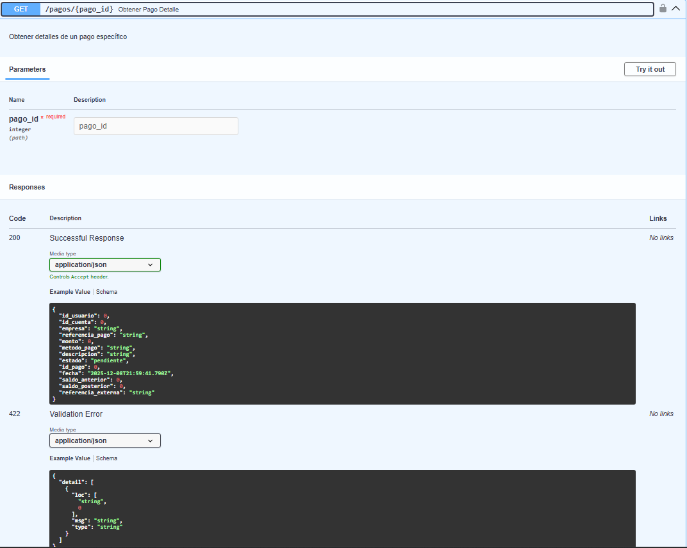

*Imagen P4: Endpoint GET /pagos/ que retorna todos los pagos de servicios del usuario autenticado. No requiere parámetros adicionales. Muestra el historial completo de pagos con información detallada: empresa, referencia, monto, método de pago, descripción, estado, fecha, saldo anterior y posterior, y referencia externa. Ideal para seguimiento y control de gastos en servicios.*

.. code-block:: bash

   curl -X GET "http://localhost:8000/pagos/" \
     -H "Authorization: Bearer {tu_token_jwt}"

Obtener Métodos de Pago
~~~~~~~~~~~~~~~~~~~~~~~~

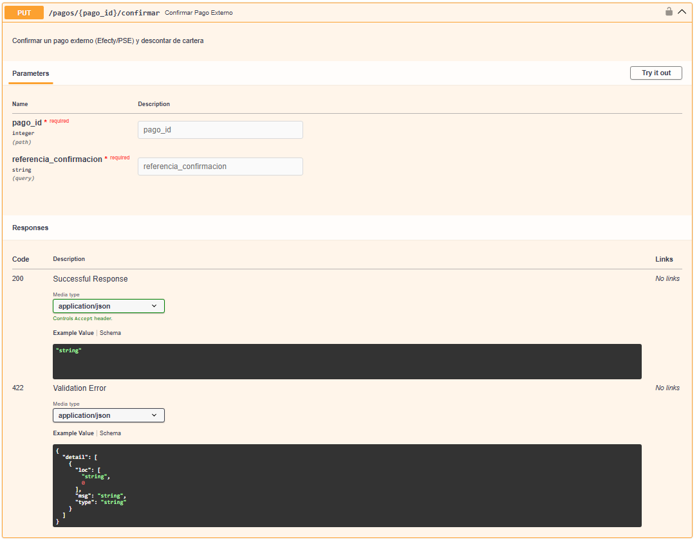

*Imagen P5: Endpoint GET /pagos/metodos-pago que retorna la lista de métodos de pago disponibles en el sistema. No requiere parámetros. Devuelve los métodos soportados como "cartera" (pago directo desde saldo), "efecty" (pago en efectivo) y "pse" (pago electrónico bancario). Útil para mostrar opciones al usuario en la interfaz de pago.*

.. code-block:: bash

   curl -X GET "http://localhost:8000/pagos/metodos-pago" \
     -H "Authorization: Bearer {tu_token_jwt}"

Obtener Detalle de Pago
~~~~~~~~~~~~~~~~~~~~~~~~

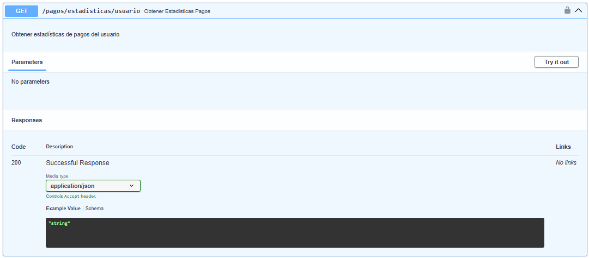

*Imagen P6: Endpoint GET /pagos/{pago_id} para consultar los detalles completos de un pago específico. Requiere el ID del pago como parámetro de ruta. Retorna toda la información del pago incluyendo empresa, referencia, monto, método, descripción, estado, fecha, saldos y referencia externa. Solo el propietario puede consultar sus pagos.*

.. code-block:: bash

   curl -X GET "http://localhost:8000/pagos/1" \
     -H "Authorization: Bearer {tu_token_jwt}"

Crear Ticket de Soporte
~~~~~~~~~~~~~~~~~~~~~~~~

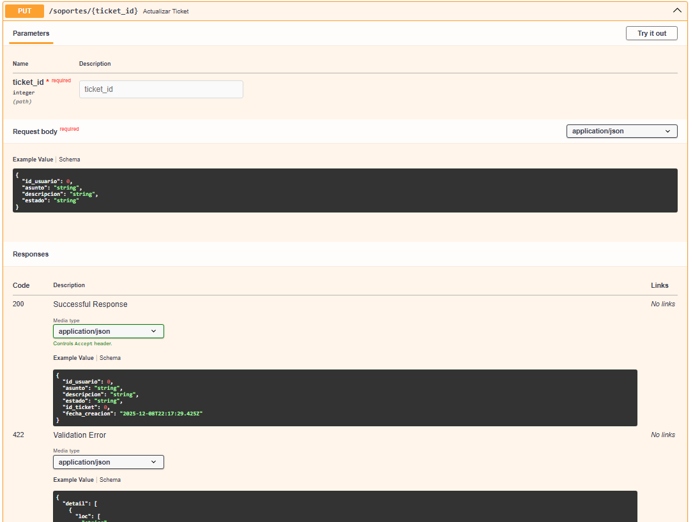

*Imagen SO3: Endpoint POST /soportes/ para crear un nuevo ticket de soporte técnico o consulta. Requiere autenticación y acepta un request body con campos como id_usuario, asunto (título del ticket), descripcion (detalle del problema o consulta) y estado (por defecto "string" o abierto). Genera automáticamente un ID de ticket y fecha de creación para seguimiento.*

.. code-block:: bash

   curl -X POST "http://localhost:8000/soportes/" \
     -H "Authorization: Bearer {tu_token_jwt}" \
     -H "Content-Type: application/json" \
     -d '{
       "id_usuario": 0,
       "asunto": "string",
       "descripcion": "string",
       "estado": "string"
     }'

Listar Tickets
~~~~~~~~~~~~~~

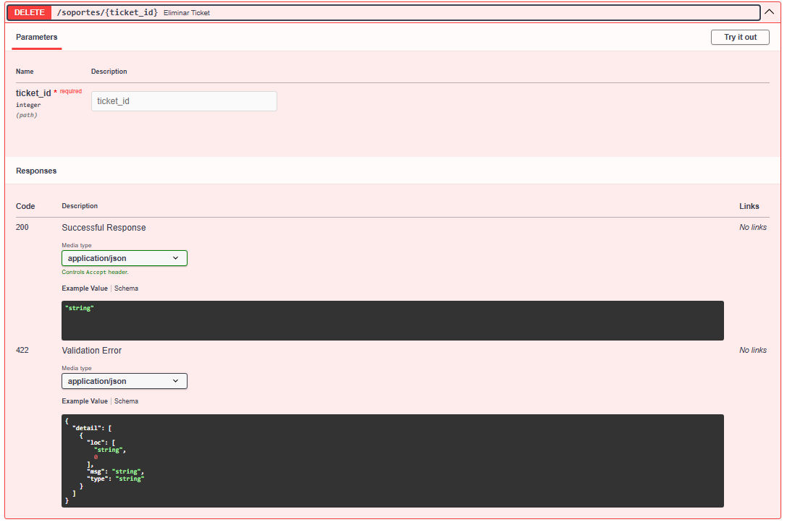

*Imagen SO4: Endpoint GET /soportes/ que retorna todos los tickets de soporte del usuario autenticado. No requiere parámetros adicionales. Muestra el historial completo de tickets con información como ID, asunto, descripción, estado (abierto/en proceso/resuelto/cerrado), fecha de creación y datos del usuario. Útil para seguimiento de consultas y problemas reportados.*

.. code-block:: bash

   curl -X GET "http://localhost:8000/soportes/" \
     -H "Authorization: Bearer {tu_token_jwt}"

Obtener Ticket
~~~~~~~~~~~~~~

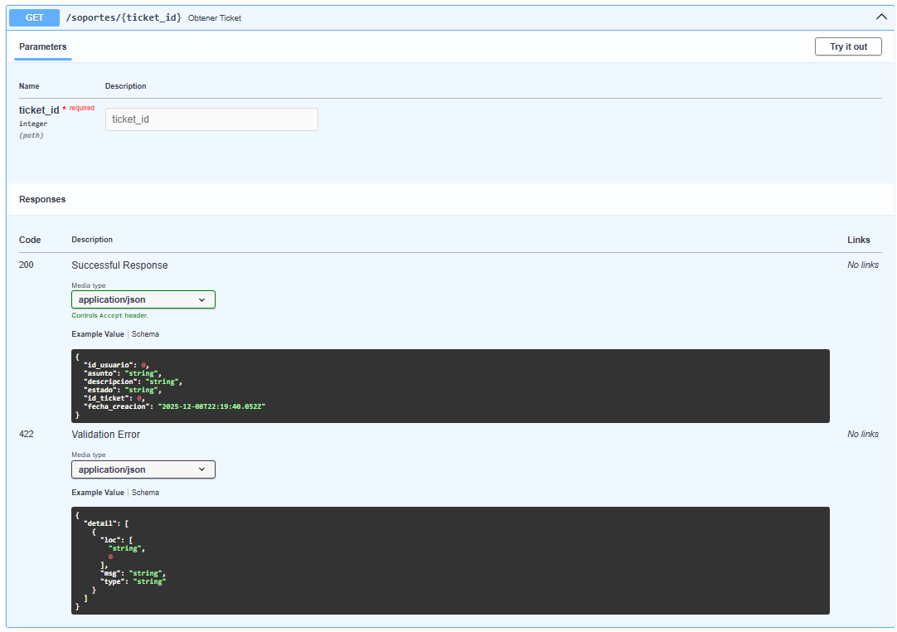

*Imagen SO5: Endpoint GET /soportes/{ticket_id} para consultar los detalles completos de un ticket específico. Requiere el ID del ticket como parámetro de ruta. Retorna toda la información del ticket incluyendo asunto, descripción detallada, estado actual, fecha de creación y datos del usuario solicitante. Solo el propietario del ticket puede consultar sus detalles.*

.. code-block:: bash

   curl -X GET "http://localhost:8000/soportes/1" \
     -H "Authorization: Bearer {tu_token_jwt}"

JavaScript (Fetch API)
~~~~~~~~~~~~~~~~~~~~~~

.. image:: _static/fastapi_23.jpg
   :alt: Ejemplos de implementación JavaScript
   :align: center
   :width: 100%

*Imagen 23: Ejemplos de código JavaScript para integrar la API en aplicaciones web. Muestra cómo hacer peticiones con Fetch API, manejar autenticación con tokens, procesar respuestas JSON y gestionar errores de forma efectiva.*

.. code-block:: javascript

   // Login
   async function login(correo, contraseña) {
     const response = await fetch('http://localhost:8000/usuarios/login-json', {
       method: 'POST',
       headers: {
         'Content-Type': 'application/json'
       },
       body: JSON.stringify({ correo, contraseña })
     });
     
     const data = await response.json();
     if (response.ok) {
       localStorage.setItem('token', data.access_token);
       return data;
     }
     throw new Error(data.detail);
   }

   // Obtener perfil
   async function obtenerPerfil() {
     const token = localStorage.getItem('token');
     const response = await fetch('http://localhost:8000/usuarios/me/complete', {
       headers: {
         'Authorization': `Bearer ${token}`
       }
     });
     
     if (response.ok) {
       return await response.json();
     }
     throw new Error('Error al obtener perfil');
   }

Python (Requests)
~~~~~~~~~~~~~~~~~

.. image:: _static/fastapi_24.jpg
   :alt: Ejemplos de implementación Python
   :align: center
   :width: 100%

*Imagen 24: Ejemplos de integración en Python usando la biblioteca requests. Demuestra cómo consumir los endpoints de la API, manejar autenticación JWT, serializar/deserializar JSON y capturar excepciones para un manejo robusto de errores.*

.. code-block:: python

   import requests

   # Login
   def login(correo: str, contraseña: str):
       response = requests.post(
           'http://localhost:8000/usuarios/login-json',
           json={'correo': correo, 'contraseña': contraseña}
       )
       if response.status_code == 200:
           return response.json()
       raise Exception(response.json()['detail'])

   # Obtener perfil
   def obtener_perfil(token: str):
       headers = {'Authorization': f'Bearer {token}'}
       response = requests.get(
           'http://localhost:8000/usuarios/me/complete',
           headers=headers
       )
       if response.status_code == 200:
           return response.json()
       raise Exception('Error al obtener perfil')

Códigos de Estado HTTP
-----------------------

.. list-table::
   :widths: 15 85
   :header-rows: 1

   * - Código
     - Descripción
   * - 200
     - Operación exitosa
   * - 201
     - Recurso creado exitosamente
   * - 400
     - Solicitud incorrecta
   * - 401
     - No autenticado - Token inválido o expirado
   * - 403
     - No autorizado - Sin permisos suficientes
   * - 404
     - Recurso no encontrado
   * - 422
     - Error de validación en los datos enviados
   * - 500
     - Error interno del servidor

Notas Importantes
-----------------

.. note::

   **Autenticación JWT**
   
   - El token JWT se obtiene al hacer login exitosamente
   - El token debe incluirse en el header ``Authorization: Bearer {token}``
   - Los tokens expiran después de cierto tiempo (configurable)
   - Endpoints marcados con 🔒 requieren autenticación

.. warning::

   **Seguridad**
   
   - Nunca compartas tu token JWT
   - Las contraseñas deben tener al menos 8 caracteres
   - Se recomienda usar HTTPS en producción
   - Los datos sensibles se encriptan en la base de datos

.. tip::

   **Mejores Prácticas**
   
   - Almacena el token de forma segura (localStorage, cookies seguras)
   - Implementa refresh tokens para mejorar la experiencia del usuario
   - Maneja los errores 401 para redirigir al login
   - Valida los datos en el frontend antes de enviarlos

Documentación Interactiva
--------------------------

FastAPI proporciona documentación interactiva automática:

.. image:: _static/fastapi_25.jpg
   :alt: Documentación interactiva de FastAPI
   :align: center
   :width: 100%

*Imagen 25: Interfaz completa de Swagger UI generada automáticamente por FastAPI. Permite explorar todos los endpoints, ver esquemas de datos, probar peticiones directamente desde el navegador con autenticación incluida, y descargar la especificación OpenAPI. Ideal para desarrollo, testing y comprensión rápida de la API.*

- **Swagger UI**: http://localhost:8000/docs
- **ReDoc**: http://localhost:8000/redoc
- **OpenAPI Schema**: http://localhost:8000/openapi.json

Estas interfaces permiten probar los endpoints directamente desde el navegador.
