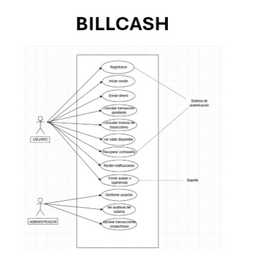

============================
Casos de Uso - BillCash
============================

.. note::
   Esta sección describe los casos de uso principales del sistema BillCash v1.0.0

Diagrama General de Casos de Uso
=================================

El siguiente diagrama muestra los casos de uso principales del sistema BillCash, 
organizados por actores (Usuario y Administrador):

.. note::
   Para visualizar el diagrama, coloque la imagen en: ``docs/source/_static/billcash_casos_uso.png``

|

Especificación Detallada de Casos de Uso
=========================================

CU-001: Crear Cuenta
====================

**Actor Principal:** Usuario

**Descripción**
---------------
El usuario podrá crear una cuenta con los datos que el sistema solicita.

**Precondición**
----------------
El usuario tiene que tener conexión a internet.

**Secuencia Normal**
--------------------

.. list-table::
   :header-rows: 1
   :widths: 10 90

   * - Paso
     - Acción
   * - 1
     - El usuario ingresa a la app y le da click al botón de registrarse
   * - 2
     - El sistema carga el formulario de registro
   * - 3
     - El usuario completa los datos requeridos
   * - 4
     - El sistema valida los datos ingresados
   * - 5
     - El sistema crea la cuenta y notifica al usuario

**Postcondición**
-----------------
El usuario tiene una cuenta en el sistema.

**Excepciones**
---------------

.. list-table::
   :header-rows: 1
   :widths: 10 90

   * - Paso
     - Acción
   * - 1
     - Si los datos no son válidos notifica al usuario
   * - 2
     - Si los datos de número de documento, teléfono o email ya existe, notifica al usuario

----

CU-002: Iniciar Sesión
======================

**Actor Principal:** Usuario

**Descripción**
---------------
El usuario ingresa al sistema con sus credenciales.

**Precondición**
----------------
El usuario tiene que tener una cuenta registrada en el sistema.

**Secuencia Normal**
--------------------

.. list-table::
   :header-rows: 1
   :widths: 10 90

   * - Paso
     - Acción
   * - 1
     - El usuario ingresa a la app y selecciona "Iniciar Sesión"
   * - 2
     - El sistema muestra el formulario de inicio de sesión
   * - 3
     - El usuario ingresa sus credenciales
   * - 4
     - El sistema valida las credenciales
   * - 5
     - El sistema permite ingresar al usuario al sistema

**Postcondición**
-----------------
El usuario tiene acceso al sistema.

**Excepciones**
---------------

.. list-table::
   :header-rows: 1
   :widths: 10 90

   * - Paso
     - Acción
   * - 1
     - Si las credenciales son incorrectas el sistema muestra un mensaje de error
   * - 2
     - Si la cuenta está bloqueada se le notifica al usuario y se inicia proceso de recuperación

----

CU-003: Enviar Dinero
=====================

**Actor Principal:** Usuario

**Descripción**
---------------
El usuario envía dinero a otro usuario del sistema.

**Precondición**
----------------
Usuario con sesión iniciada y saldo suficiente.

**Secuencia Normal**
--------------------

.. list-table::
   :header-rows: 1
   :widths: 10 90

   * - Paso
     - Acción
   * - 1
     - El usuario selecciona "Enviar dinero"
   * - 2
     - El sistema muestra el formulario de envío
   * - 3
     - El usuario ingresa el destinatario y el monto
   * - 4
     - El sistema valida los datos
   * - 5
     - El usuario confirma la operación
   * - 6
     - El sistema registra la transacción pendiente
   * - 7
     - El sistema evalúa la transacción
   * - 8
     - El sistema completa la transacción

**Postcondición**
-----------------
El dinero es transferido al otro usuario.

**Excepciones**
---------------

.. list-table::
   :header-rows: 1
   :widths: 10 90

   * - Paso
     - Acción
   * - 4
     - Si el destinatario no existe el sistema muestra un mensaje de error
   * - 4
     - Si el saldo es insuficiente se le notifica al usuario

----

CU-004: Ver Transacciones
==========================

**Actor Principal:** Usuario

**Descripción**
---------------
El usuario consulta el historial de sus transacciones.

**Precondición**
----------------
El usuario tiene que haber iniciado sesión.

**Secuencia Normal**
--------------------

.. list-table::
   :header-rows: 1
   :widths: 10 90

   * - Paso
     - Acción
   * - 1
     - El usuario selecciona "Ver transacciones"
   * - 2
     - El sistema hace consulta para cargar sus transacciones
   * - 3
     - El sistema muestra las transacciones del usuario
   * - 4
     - El usuario puede filtrar por fecha y tipo

**Postcondición**
-----------------
El usuario visualiza su historial.

**Excepciones**
---------------

.. list-table::
   :header-rows: 1
   :widths: 10 90

   * - Paso
     - Acción
   * - 2
     - Si no hay transacciones el sistema muestra el mensaje: "No hay transacciones"

----

CU-005: Cancelar Transacción
=============================

**Actor Principal:** Usuario

**Descripción**
---------------
El usuario puede cancelar transacciones que todavía no se han finalizado.

**Precondición**
----------------
Transacción en estado de pendiente o en proceso.

**Secuencia Normal**
--------------------

.. list-table::
   :header-rows: 1
   :widths: 10 90

   * - Paso
     - Acción
   * - 1
     - El usuario selecciona "Ver transacciones"
   * - 2
     - El usuario selecciona una transacción en estado no finalizado
   * - 3
     - El usuario selecciona "Cancelar"
   * - 4
     - El sistema solicita información de confirmación
   * - 5
     - El usuario confirma
   * - 6
     - El sistema cancela la transacción

**Postcondición**
-----------------
La transacción queda cancelada.

**Excepciones**
---------------

.. list-table::
   :header-rows: 1
   :widths: 10 90

   * - Paso
     - Acción
   * - 2
     - Si la transacción no es cancelable, el sistema muestra un mensaje
   * - 5
     - Si ya fue aprobada, el sistema muestra error

----

CU-006: Gestionar Usuarios
===========================

**Actor Principal:** Administrador

**Descripción**
---------------
El administrador podrá gestionar a los usuarios.

**Precondición**
----------------
Sesión de administrador activa.

**Secuencia Normal**
--------------------

.. list-table::
   :header-rows: 1
   :widths: 10 90

   * - Paso
     - Acción
   * - 1
     - Administrador selecciona "Gestionar Usuario"
   * - 2
     - El sistema muestra a los usuarios
   * - 3
     - Administrador puede filtrar o buscar a un usuario
   * - 4
     - Administrador selecciona "Editar, Ver detalles, etc."
   * - 5
     - Sistema realiza la acción solicitada

**Postcondición**
-----------------
Se hace el ajuste en el usuario seleccionado.

**Excepciones**
---------------

.. list-table::
   :header-rows: 1
   :widths: 10 90

   * - Paso
     - Acción
   * - 4
     - Si el usuario no existe, muestra mensaje de error

----

Relaciones entre Casos de Uso
==============================

Dependencias
------------

.. list-table::
   :header-rows: 1
   :widths: 40 60

   * - Caso de Uso
     - Depende de
   * - CU-002: Iniciar Sesión
     - CU-001: Crear Cuenta (debe existir cuenta)
   * - CU-003: Enviar Dinero
     - CU-002: Iniciar Sesión (requiere autenticación)
   * - CU-004: Ver Transacciones
     - CU-002: Iniciar Sesión (requiere autenticación)
   * - CU-005: Cancelar Transacción
     - CU-004: Ver Transacciones (para seleccionar transacción)
   * - CU-006: Gestionar Usuarios
     - CU-002: Iniciar Sesión (requiere rol de administrador)

Matriz de Trazabilidad
======================

Relación entre Requisitos Funcionales y Casos de Uso:

.. list-table::
   :header-rows: 1
   :widths: 30 40 30

   * - Caso de Uso
     - Requisitos Funcionales
     - Prioridad
   * - CU-001: Crear Cuenta
     - RF-001: Registro de Usuarios
     - Alta
   * - CU-002: Iniciar Sesión
     - RF-002: Autenticación y Autorización
     - Alta
   * - CU-003: Enviar Dinero
     - RF-008: Registro de Pagos, RF-009: Procesamiento de Pagos
     - Alta
   * - CU-004: Ver Transacciones
     - RF-012: Historial del Cliente
     - Alta
   * - CU-005: Cancelar Transacción
     - RF-006: Edición y Cancelación
     - Media
   * - CU-006: Gestionar Usuarios
     - RF-001, RF-002, RF-003
     - Alta

Actores del Sistema
===================

.. list-table::
   :header-rows: 1
   :widths: 20 80

   * - Actor
     - Descripción
   * - Usuario
     - Usuario estándar con cuenta en el sistema. Puede crear cuenta, iniciar sesión, enviar dinero, ver transacciones y cancelar transacciones.
   * - Administrador
     - Usuario con permisos administrativos. Tiene acceso a todos los casos de uso del Usuario más la gestión de usuarios del sistema.

Resumen de Casos de Uso por Actor
==================================

**Usuario:**

- CU-001: Crear Cuenta
- CU-002: Iniciar Sesión
- CU-003: Enviar Dinero
- CU-004: Ver Transacciones
- CU-005: Cancelar Transacción

**Administrador:**

- Todos los casos de uso del Usuario
- CU-006: Gestionar Usuarios

Notas de Implementación
========================

Secuencia Recomendada
---------------------

Para el desarrollo del sistema, se recomienda implementar los casos de uso en el siguiente orden:

**Fase 1 - Autenticación y Usuarios:**

1. CU-001: Crear Cuenta
2. CU-002: Iniciar Sesión
3. CU-006: Gestionar Usuarios

**Fase 2 - Transacciones Core:**

4. CU-003: Enviar Dinero
5. CU-004: Ver Transacciones
6. CU-005: Cancelar Transacción

Consideraciones Técnicas
-------------------------

**Autenticación:**

- Implementar JWT para manejo de sesiones
- Timeout de sesión: 30 minutos de inactividad
- Encriptación de contraseñas con bcrypt o Argon2
- Autenticación de dos factores (2FA) opcional

**Autorización:**

- Sistema basado en roles (RBAC): Usuario y Administrador
- Permisos granulares por caso de uso
- Validación de permisos en backend y frontend

**Transacciones:**

- Sistema de estados: Pendiente → En Proceso → Completada/Cancelada
- Validación de saldo antes de procesar transacción
- Log de auditoría para cada transacción
- Timeout de transacciones pendientes: 24 horas

**Seguridad:**

- Validación de datos en cliente y servidor
- Sanitización de inputs para prevenir SQL Injection
- Rate limiting para prevenir ataques de fuerza bruta
- HTTPS obligatorio para todas las comunicaciones

**Base de Datos:**

- Tablas principales: usuarios, transacciones, auditoría
- Índices en campos de búsqueda frecuente
- Backup automático diario
- Retención de logs: mínimo 1 año

Diagrama de Estados - Transacción
==================================

.. code-block:: text

   [Iniciada] --> [Pendiente] --> [En Proceso] --> [Completada]
                       |                |
                       |                |
                       +----------------+--> [Cancelada]

**Estados:**

- **Iniciada:** Transacción creada por el usuario
- **Pendiente:** Esperando validación del sistema
- **En Proceso:** Validación en curso
- **Completada:** Transacción exitosa
- **Cancelada:** Transacción cancelada por usuario o sistema

Glosario de Términos
=====================

.. glossary::

   Usuario
      Persona registrada en el sistema con capacidad de realizar transacciones.

   Administrador
      Usuario con permisos especiales para gestionar el sistema y otros usuarios.

   Transacción
      Operación de transferencia de dinero entre dos usuarios del sistema.

   Sesión
      Periodo de tiempo en el que un usuario permanece autenticado en el sistema.

   Token JWT
      JSON Web Token utilizado para mantener la sesión del usuario de forma segura.

   Saldo
      Cantidad de dinero disponible en la cuenta de un usuario.

Referencias
===========

Para más información, consulte:

- :doc:`index` - Requisitos Funcionales Completos
- :doc:`index` - Requisitos No Funcionales
- :doc:`index` - Stack Tecnológico

----

**Última actualización:** Octubre 2025

**Versión del documento:** 1.0.0
