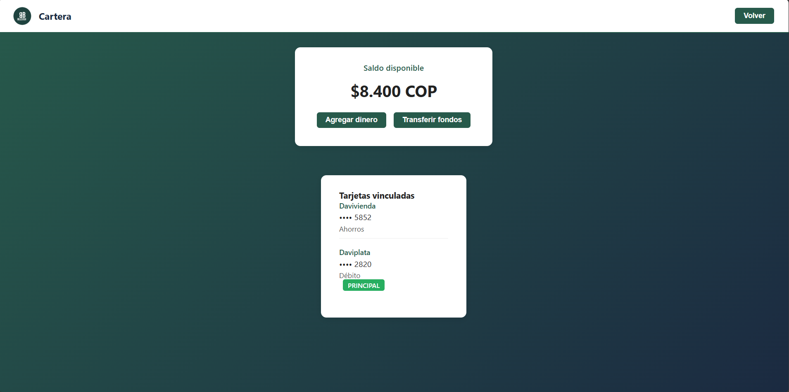

=======================
Cartera (Transacciones)
=======================

Cómo consultar tu historial de transacciones
=============================================

La Cartera te permite ver todas tus transacciones realizadas y gestionar tu dinero.

|

Acceso a la Cartera
===================

1. **Haz clic en "Cartera"**
   
   Desde el menú principal o el dashboard, selecciona la opción de cartera.

2. **Espera la carga**
   
   El sistema consultará tu historial. Verás el mensaje "Cargando..." 
   mientras se obtienen los datos.

Información mostrada
====================

Para cada transacción verás:

* **Tipo:** Envío, Solicitud, Recepción
* **Usuario:** Con quién realizaste la transacción
* **Monto:** Cantidad de dinero
* **Fecha y hora:** Cuándo se realizó
* **Estado:** Pendiente, Completada, Cancelada
* **Mensaje:** Nota asociada (si existe)

Saldo y balance
===============

En la parte superior de la Cartera verás:

* **Saldo actual:** Dinero disponible en tu cuenta
* **Saldo total:** Incluyendo dinero en transacciones pendientes
* **Balance del mes:** Resumen de ingresos y egresos

Filtros disponibles
===================

Puedes filtrar las transacciones por:

* **Fecha:** Selecciona un rango de fechas
* **Tipo:** Envíos, Recepciones, Solicitudes
* **Estado:** Todas, Pendientes, Completadas, Canceladas

Acciones disponibles
====================

Desde esta pantalla puedes:

* 👁️ Ver detalles completos de una transacción
* ❌ Cancelar transacciones pendientes
* 📄 Exportar tu historial (PDF, Excel)
* 🔍 Buscar transacciones específicas
* 💳 Recargar saldo
* 🏦 Retirar dinero

Estados de transacciones
=========================

.. list-table::
   :header-rows: 1
   :widths: 20 80

   * - Estado
     - Descripción
   * - 🟡 Pendiente
     - Transacción creada, esperando procesamiento
   * - 🔵 En Proceso
     - El sistema está validando la transacción
   * - 🟢 Completada
     - Transacción exitosa, dinero transferido
   * - 🔴 Cancelada
     - Transacción cancelada por usuario o sistema
   * - ⚠️ Error
     - Ocurrió un error, contacta soporte

Botón Volver
============

En la esquina superior derecha encontrarás el botón "Volver" para regresar 
al menú principal.
