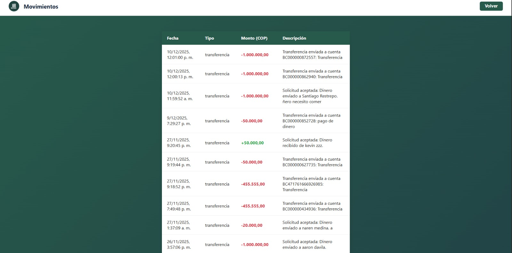

=======================
Cartera (Transacciones)
=======================

Historial de Movimientos
=========================

La Cartera te permite ver todas tus transacciones realizadas y gestionar tu dinero.

|

Detalles de tus Movimientos
============================

En la pantalla de Movimientos puedes ver todas tus transacciones con información detallada:

**Columnas mostradas:**

📅 **Fecha**
   * Fecha y hora exacta de la transacción
   * Formato: DD/MM/AAAA, HH:MM a.m./p.m.

🔄 **Tipo**
   * transferencia - Envío o recepción de dinero
   * solicitud - Solicitud aceptada
   * pago - Pago de servicios

💵 **Monto (COP)**
   * En **rojo** (-): Dinero enviado/gastado
   * En **verde** (+): Dinero recibido
   * Formato: -1.000.000,00 o +50.000,00

📝 **Descripción**
   * Detalles de la transacción
   * Destinatario o remitente
   * Número de cuenta
   * Concepto del pago

Ejemplo de Transacciones
=========================

Según la imagen, puedes ver transacciones como:

**Envíos:**

.. code-block:: text

   10/12/2025, 12:01:00 p.m.  | transferencia | -1.000.000,00
   Transferencia enviada a cuenta BC00000872557: Transferencia

**Recepciones:**

.. code-block:: text

   27/11/2025, 9:20:45 p.m.  | transferencia | +50.000,00
   Solicitud aceptada: Dinero recibido de kevin zzz.

**Solicitudes Aceptadas:**

.. code-block:: text

   10/12/2025, 11:59:52 a.m. | transferencia | -1.000.000,00
   Solicitud aceptada: Dinero enviado a Santiago Restrepo. 
   hero necesito comer

Acceso a la Cartera
===================

1. **Haz clic en "Cartera"**
   
   Desde el menú principal o el dashboard, selecciona la opción de cartera.

2. **Espera la carga**
   
   El sistema consultará tu historial. Verás el mensaje "Cargando..." 
   mientras se obtienen los datos.

Información mostrada
====================

Para cada transacción verás:

* **Tipo:** Envío, Solicitud, Recepción
* **Usuario:** Con quién realizaste la transacción
* **Monto:** Cantidad de dinero
* **Fecha y hora:** Cuándo se realizó
* **Estado:** Pendiente, Completada, Cancelada
* **Mensaje:** Nota asociada (si existe)

Saldo y balance
===============

En la parte superior de la Cartera verás:

* **Saldo actual:** Dinero disponible en tu cuenta
* **Saldo total:** Incluyendo dinero en transacciones pendientes
* **Balance del mes:** Resumen de ingresos y egresos

Filtros disponibles
===================

Puedes filtrar las transacciones por:

* **Fecha:** Selecciona un rango de fechas
* **Tipo:** Envíos, Recepciones, Solicitudes
* **Estado:** Todas, Pendientes, Completadas, Canceladas

Acciones disponibles
====================

Desde esta pantalla puedes:

* 👁️ Ver detalles completos de una transacción
* ❌ Cancelar transacciones pendientes
* 📄 Exportar tu historial (PDF, Excel)
* 🔍 Buscar transacciones específicas
* 💳 Recargar saldo
* 🏦 Retirar dinero

Estados de transacciones
=========================

.. list-table::
   :header-rows: 1
   :widths: 20 80

   * - Estado
     - Descripción
   * - 🟡 Pendiente
     - Transacción creada, esperando procesamiento
   * - 🔵 En Proceso
     - El sistema está validando la transacción
   * - 🟢 Completada
     - Transacción exitosa, dinero transferido
   * - 🔴 Cancelada
     - Transacción cancelada por usuario o sistema
   * - ⚠️ Error
     - Ocurrió un error, contacta soporte

Botón Volver
============

En la esquina superior derecha encontrarás el botón "Volver" para regresar 
al menú principal.
