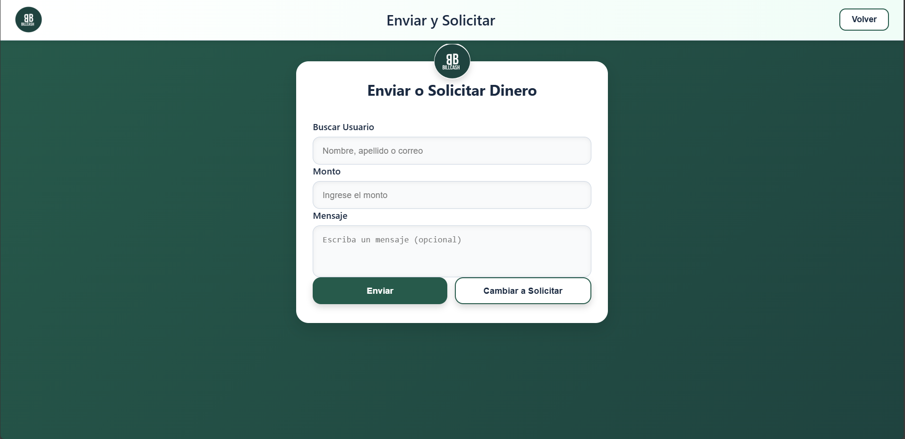

==============
Enviar Dinero
==============

Cómo transferir dinero a otros usuarios
========================================

La función principal de BillCash es enviar dinero de forma rápida y segura.

|

Pasos para enviar dinero
=========================

1. **Accede a "Enviar y Solicitar"**
   
   Desde el menú principal, selecciona la opción de transacciones.

2. **Completa el formulario de envío**
   
   * **Buscar Usuario:** Escribe el nombre, apellido o correo del destinatario
   * **Monto:** Ingresa la cantidad de dinero que deseas enviar
   * **Mensaje:** (Opcional) Agrega un mensaje o nota sobre el envío

3. **Verifica los datos**
   
   Asegúrate de que el usuario destinatario y el monto sean correctos.

4. **Haz clic en "Enviar"**
   
   El botón verde procesará la transacción.

Funcionalidades adicionales
============================

* **Cambiar a Solicitar:** Si deseas solicitar dinero en lugar de enviarlo, 
  haz clic en el botón blanco "Cambiar a Solicitar"
* **Volver:** Botón en la esquina superior derecha para regresar al menú principal

Validaciones del sistema
=========================

.. warning::
   * El destinatario debe existir en el sistema
   * Debes tener saldo suficiente para realizar el envío
   * El monto debe ser mayor a cero
   * La transacción quedará en estado "Pendiente" hasta su aprobación

Estados de la transacción
==========================

1. **Pendiente:** Transacción creada, esperando validación
2. **En Proceso:** El sistema está procesando la transferencia
3. **Completada:** Dinero transferido exitosamente
4. **Cancelada:** Transacción cancelada por el usuario o sistema
