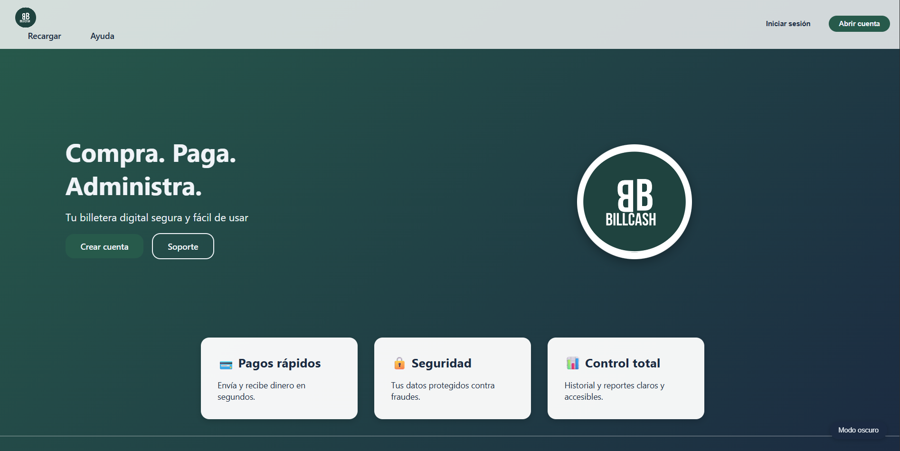

==============================
Manual de Usuario - BillCash
==============================

.. note::
   Este manual describe el uso de la aplicación BillCash v1.0.0

Bienvenido al Manual de Usuario
================================

Este manual te guiará paso a paso en el uso de todas las funcionalidades de **BillCash**, 
la aplicación para gestión de transacciones de dinero entre usuarios.

|

Contenido del Manual
====================

.. toctree::
   :maxdepth: 2
   :numbered:

   manual_introduccion
   manual_registro
   manual_login
   manual_recuperar_contrasena
   manual_home
   manual_enviar
   manual_solicitar
   manual_cartera
   manual_tarjetas
   manual_servicios

----

Navegación Rápida
=================

📖 **Primeros Pasos:**

* :doc:`manual_introduccion` - Conoce BillCash y sus características
* :doc:`manual_registro` - Crea tu cuenta
* :doc:`manual_login` - Accede al sistema
* :doc:`manual_recuperar_contrasena` - Recupera tu contraseña

💰 **Transacciones:**

* :doc:`manual_home` - Panel de control principal
* :doc:`manual_enviar` - Envía dinero a otros usuarios
* :doc:`manual_solicitar` - Solicita dinero
* :doc:`manual_cartera` - Consulta tu historial

💳 **Gestión Financiera:**

* :doc:`manual_tarjetas` - Administra tus tarjetas
* :doc:`manual_servicios` - Paga servicios (Luz, Agua, Gas, etc.)

----

Información Adicional
=====================

**Versión actual:** 1.0.0

**Última actualización:** Diciembre 2025

**Soporte:**

* Email: soporte@billcash.com
* Documentación completa: https://joelml1.github.io/documentacion_billcash/

----

© 2025 BillCash - Todos los derechos reservados
