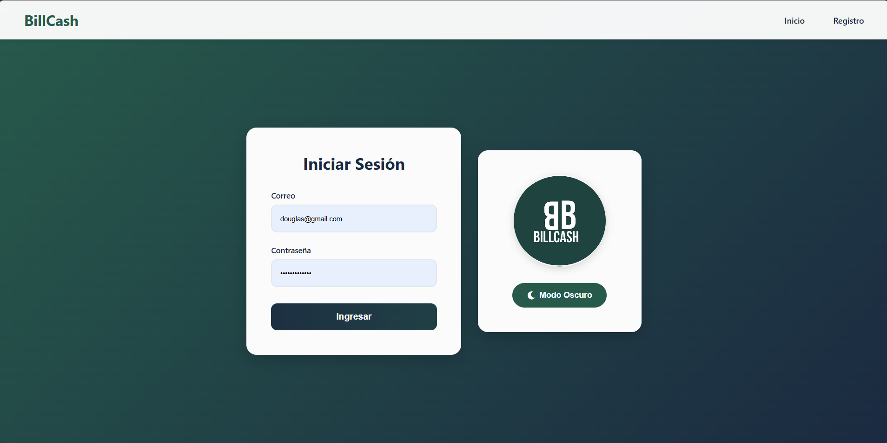

===============
Iniciar Sesión
===============

Cómo acceder a tu cuenta
=========================

Una vez registrado, puedes iniciar sesión para acceder a todas las funcionalidades.

|

Pasos para iniciar sesión
==========================

1. **Accede a la pantalla de inicio**
   
   Si ya tienes cuenta, haz clic en "Inicio" en el menú superior derecho.

2. **Ingresa tus credenciales**
   
   * **Correo:** Escribe el correo electrónico con el que te registraste
   * **Contraseña:** Ingresa tu contraseña (se mostrará oculta)

3. **Haz clic en "Ingresar"**
   
   Presiona el botón verde para acceder al sistema.

4. **Acceso exitoso**
   
   Serás redirigido al dashboard principal de la aplicación.

Características de seguridad
=============================

* 🔒 Las contraseñas se muestran ocultas por seguridad
* ⏱️ Las sesiones expiran después de 30 minutos de inactividad
* 🔐 Validación de credenciales en tiempo real

¿Olvidaste tu contraseña?
==========================

.. note::
   Si olvidaste tu contraseña, puedes recuperarla mediante el enlace 
   "¿Olvidaste tu contraseña?" (funcionalidad en desarrollo).

Opciones de tema
=================

El botón "🌙 Modo Oscuro" te permite cambiar entre tema claro y oscuro para mayor comodidad visual.
