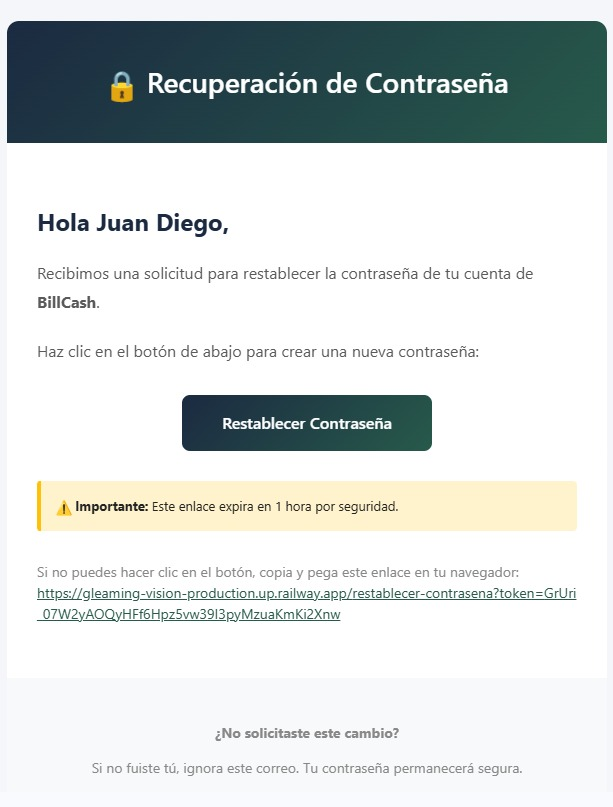
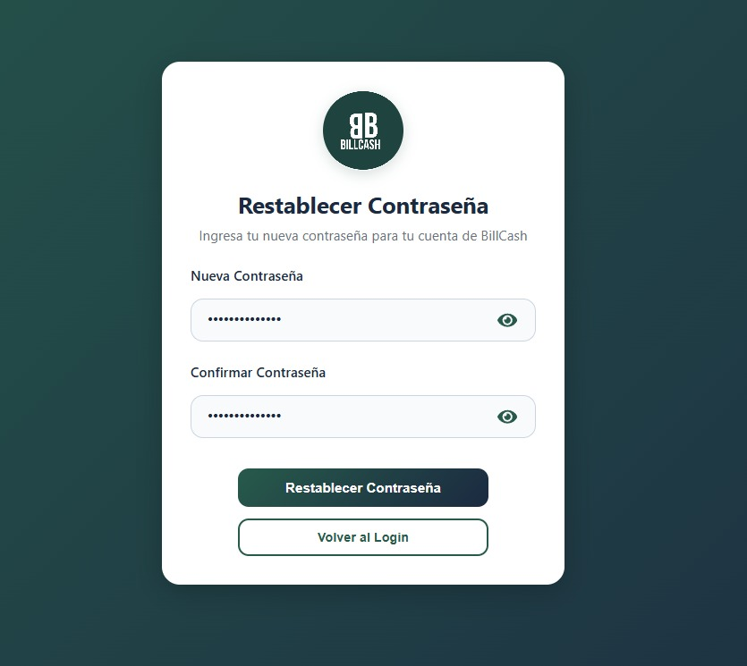
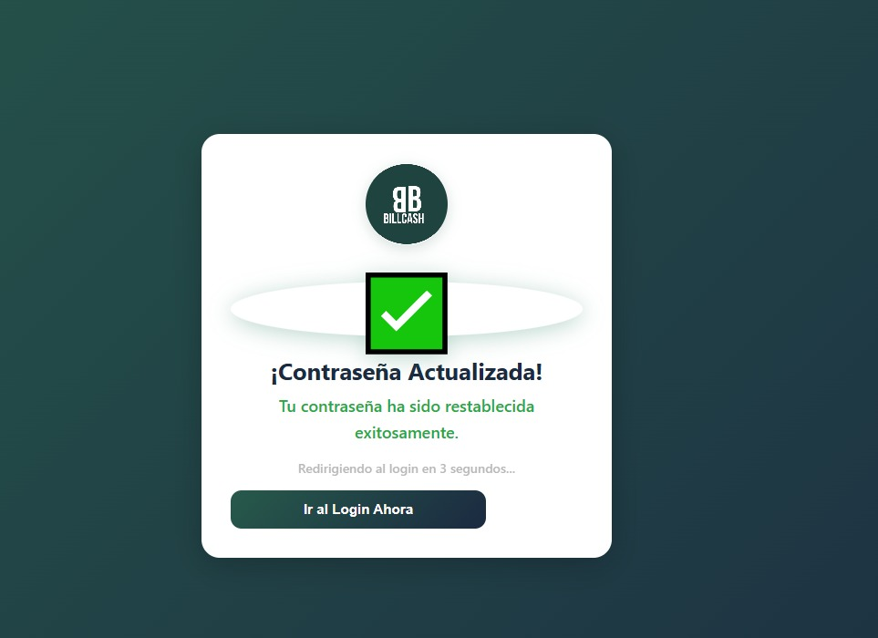

============================
Recuperación de Contraseña
============================

¿Olvidaste tu contraseña?
==========================

Si olvidaste tu contraseña de BillCash, puedes restablecerla fácilmente 
siguiendo estos pasos.

Solicitar Restablecimiento
===========================

1. **Accede al Login**
   
   Ve a la pantalla de inicio de sesión de BillCash

2. **Haz clic en "¿Olvidaste tu contraseña?"**
   
   Encontrarás este enlace debajo del botón de login

3. **Ingresa tu correo electrónico**
   
   Escribe el email asociado a tu cuenta de BillCash

4. **Haz clic en "Enviar"**
   
   Recibirás un correo con instrucciones

Email de Recuperación
======================

Recibirás un correo como este:

|

El correo contiene:

📧 **Asunto:** 🔒 Recuperación de Contraseña

**Contenido:**

.. code-block:: text

   Hola Juan Diego,
   
   Recibimos una solicitud para restablecer la contraseña de tu cuenta de BillCash.
   
   Haz clic en el botón de abajo para crear una nueva contraseña:
   
   [Restablecer Contraseña]
   
   ⚠️ Importante: Este enlace expira en 1 hora por seguridad.
   
   Si no puedes hacer clic en el botón, copia y pega este enlace en tu navegador:
   https://gleaming-vision-production.up.railway.app/restablecer-contrasena?token=...
   
   ¿No solicitaste este cambio?
   Si no fuiste tú, ignora este correo. Tu contraseña permanecerá segura.

Crear Nueva Contraseña
=======================

1. **Haz clic en "Restablecer Contraseña"**
   
   Desde el correo o copia el enlace en tu navegador

2. **Completa el formulario**

|

Ingresa los siguientes datos:

* **Nueva Contraseña:** Tu nueva contraseña segura
  
  * Mínimo 8 caracteres
  * Al menos una mayúscula
  * Al menos un número
  * Caracteres especiales (recomendado)

* **Confirmar Contraseña:** Escribe nuevamente la contraseña

👁️ **Mostrar/Ocultar:** Usa el ícono del ojo para ver la contraseña mientras escribes

3. **Haz clic en "Restablecer Contraseña"**
   
   El botón verde procesará el cambio

Confirmación
============

Si todo es correcto, verás esta pantalla:

|

**¡Contraseña Actualizada!**

✅ Tu contraseña ha sido restablecida exitosamente.

* Serás redirigido al login automáticamente en 3 segundos
* O haz clic en "Ir al Login Ahora"

Iniciar Sesión
==============

Una vez confirmado:

1. Serás redirigido a la pantalla de login
2. Ingresa tu correo electrónico
3. Usa tu nueva contraseña
4. Haz clic en "Iniciar Sesión"

Seguridad
=========

🔐 **Recomendaciones:**

* **Usa una contraseña fuerte:** Combina letras, números y símbolos
* **No reutilices contraseñas:** Usa una única para BillCash
* **Cambia tu contraseña regularmente:** Al menos cada 3-6 meses
* **No compartas tu contraseña:** BillCash nunca te la solicitará

🛡️ **Protección:**

* Los enlaces expiran en 1 hora para tu seguridad
* Las contraseñas se almacenan encriptadas
* Recibes notificación de cambios de contraseña
* Puedes activar autenticación de dos factores

Problemas Comunes
=================

❌ **"El enlace ha expirado"**
   
   * Los enlaces son válidos solo por 1 hora
   * Solicita un nuevo restablecimiento desde el login

❌ **"No recibí el correo"**
   
   * Revisa tu carpeta de spam/correo no deseado
   * Verifica que el email sea correcto
   * Espera unos minutos (puede demorar)
   * Solicita el envío nuevamente

❌ **"Las contraseñas no coinciden"**
   
   * Asegúrate de escribir exactamente la misma contraseña en ambos campos
   * Usa el ícono del ojo para verificar

❌ **"La contraseña no es segura"**
   
   * Debe tener al menos 8 caracteres
   * Incluye mayúsculas, minúsculas y números
   * Agrega caracteres especiales (@, #, $, etc.)

Volver al Login
===============

Si no deseas restablecer la contraseña:

* Haz clic en "Volver al Login"
* Regresarás a la pantalla de inicio de sesión

----

.. warning::
   **Importante:** Si no solicitaste el cambio de contraseña, ignora el correo 
   y contacta a soporte inmediatamente: soporte@billcash.com

.. tip::
   **Consejo:** Guarda tu contraseña en un gestor de contraseñas seguro 
   para no olvidarla nuevamente.
