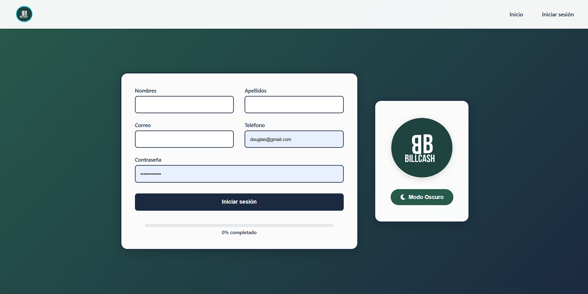

====================
Registro de Usuario
====================

Cómo crear tu cuenta en BillCash
=================================

La pantalla de registro te permite crear una nueva cuenta en el sistema.

|

Pasos para registrarte
=======================

1. **Accede a la aplicación**
   
   Abre BillCash en tu navegador o aplicación móvil.

2. **Haz clic en "Registro"**
   
   En la pantalla de inicio, selecciona la opción de registro.

3. **Completa el formulario**
   
   Llena los siguientes campos obligatorios:
   
   * **Nombres:** Tu(s) nombre(s) completo(s)
   * **Apellidos:** Tus apellidos completos
   * **Correo:** Tu dirección de correo electrónico (será tu usuario)
   * **Teléfono:** Tu número telefónico (solo números, máximo 10 dígitos)
   * **Contraseña:** Crea una contraseña segura (se mostrará como puntos)

4. **Revisa el progreso**
   
   En la parte inferior verás una barra de progreso indicando "40% completado".

5. **Haz clic en "Iniciar sesión"**
   
   Una vez completado el formulario, presiona el botón azul oscuro.

Validaciones importantes
=========================

.. warning::
   * El correo debe ser único (no puede estar registrado previamente)
   * El teléfono debe contener solo números, máximo 10 dígitos
   * La contraseña debe ser segura
   * Todos los campos son obligatorios

Elementos adicionales
======================

* **Logo BillCash:** En el panel derecho se muestra el logo de la aplicación
* **Modo Oscuro:** Botón disponible para cambiar el tema visual
