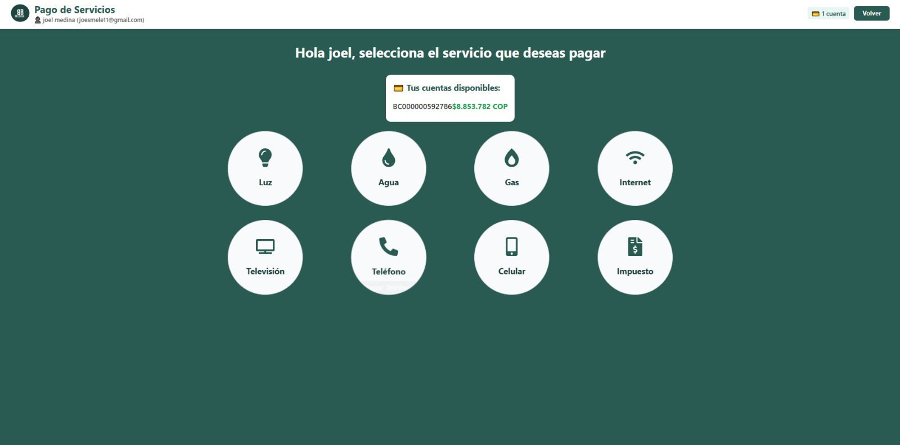

===================
Pago de Servicios
===================

Paga tus servicios desde BillCash
==================================

BillCash te permite pagar diversos servicios públicos y privados directamente 
desde tu billetera digital de forma rápida y segura.

|

Servicios Disponibles
======================

Puedes pagar los siguientes servicios:

💡 **Luz (Energía Eléctrica)**
   * Empresa de energía
   * Pago de facturas mensuales
   * Consulta de saldo

💧 **Agua**
   * Servicio de acueducto
   * Pago de consumo mensual
   * Historial de pagos

🔥 **Gas**
   * Gas natural o propano
   * Facturas domiciliarias
   * Recargas de gas

📡 **Internet**
   * Proveedores de servicio de internet
   * Planes de datos
   * Renovación de servicio

📺 **Televisión**
   * TV por cable
   * Plataformas de streaming
   * Paquetes de canales

📞 **Teléfono**
   * Línea fija
   * Planes telefónicos
   * Servicios adicionales

📱 **Celular**
   * Recargas de saldo
   * Pago de planes pospago
   * Paquetes de datos

💵 **Impuestos**
   * Impuesto predial
   * Impuesto vehicular
   * Otros tributos

Cómo Pagar un Servicio
=======================

1. **Selecciona el servicio**
   
   Haz clic en el ícono del servicio que deseas pagar (Luz, Agua, Gas, etc.)

2. **Tu cuenta disponible**
   
   En la parte superior verás tu saldo disponible:
   
   .. code-block:: text
   
      💳 Tus cuentas disponibles:
      BC00000059278658 $8.853.782 COP

3. **Ingresa los datos del servicio**
   
   * Número de cuenta o contrato
   * Valor a pagar (si no está prefijado)
   * Referencia o número de factura

4. **Verifica el monto**
   
   Revisa que el monto y los datos sean correctos

5. **Confirma el pago**
   
   * Autoriza la transacción
   * Recibirás una confirmación inmediata
   * Se generará un comprobante digital

Confirmación y Comprobante
===========================

Después de realizar el pago:

✅ **Confirmación Inmediata**
   * Notificación en pantalla
   * Email con detalles de la transacción
   * Comprobante descargable en PDF

📊 **Información del Comprobante:**
   * Fecha y hora de la transacción
   * Servicio pagado
   * Monto
   * Número de referencia
   * Cuenta origen

🔍 **Consulta de Historial:**
   * Accede a "Movimientos" para ver tus pagos
   * Filtra por tipo "Pago de Servicio"
   * Descarga reportes mensuales

Pagos Recurrentes
==================

Programa pagos automáticos:

⚙️ **Configurar Pago Automático:**
   1. Selecciona el servicio
   2. Activa "Pago Recurrente"
   3. Define la fecha de pago (día del mes)
   4. Confirma la configuración

✨ **Beneficios:**
   * Nunca olvides pagar tus servicios
   * Evita recargos por mora
   * Ahorra tiempo cada mes
   * Recibe recordatorios previos

🛑 **Cancelar o Modificar:**
   * Accede a "Servicios Recurrentes"
   * Edita la configuración
   * Cancela cuando desees

Beneficios del Pago en BillCash
================================

✅ **Comodidad**
   * Paga desde cualquier lugar
   * Disponible 24/7
   * Sin filas ni desplazamientos

💰 **Sin Comisiones Adicionales**
   * Pagas solo el valor del servicio
   * No hay cargos ocultos
   * Usa el saldo de tu billetera

🔔 **Notificaciones**
   * Recordatorios de vencimiento
   * Confirmación de pago
   * Alertas de servicios próximos a vencer

🧾 **Organización**
   * Todo tu historial en un solo lugar
   * Reportes mensuales automáticos
   * Exporta tus comprobantes

Seguridad en Pagos
==================

🔒 **Protección de Datos**
   * Conexión encriptada (SSL)
   * Validación de dos factores
   * Datos bancarios seguros

🛡️ **Verificación de Pagos**
   * Confirmación antes de procesar
   * Validación con empresas prestadoras
   * Garantía de entrega del pago

Volver al Dashboard
===================

Para regresar al menú principal:

* Haz clic en el botón "Volver" en la parte superior
* O usa el menú de navegación

----

.. tip::
   **Recomendación:** Guarda tus números de cuenta favoritos para 
   agilizar futuros pagos.

.. note::
   **Importante:** Verifica siempre el número de cuenta antes de 
   confirmar el pago para evitar errores.
