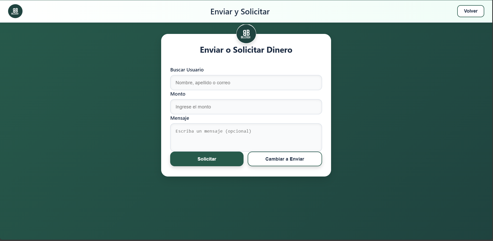

=================
Solicitar Dinero
=================

Cómo solicitar dinero a otros usuarios
=======================================

Además de enviar, puedes solicitar dinero a otros usuarios del sistema.

|

Pasos para solicitar dinero
============================

1. **Cambia al modo "Solicitar"**
   
   Si estás en la pantalla de "Enviar", haz clic en "Cambiar a Solicitar".
   Los botones cambiarán: "Solicitar" (verde) y "Cambiar a Enviar" (blanco).

2. **Completa el formulario**
   
   * **Buscar Usuario:** Escribe el nombre, apellido o correo de quien solicitas dinero
   * **Monto:** Ingresa la cantidad que deseas solicitar
   * **Mensaje:** (Opcional) Explica el motivo de tu solicitud

3. **Haz clic en "Solicitar"**
   
   El botón verde enviará la solicitud al usuario.

Diferencias entre Enviar y Solicitar
=====================================

.. list-table::
   :header-rows: 1
   :widths: 40 60

   * - Enviar Dinero
     - Solicitar Dinero
   * - Requieres tener saldo
     - No requieres saldo
   * - Tú inicias la transacción
     - El otro usuario debe aprobar
   * - El dinero se transfiere de inmediato
     - Queda pendiente hasta aprobación

Notificaciones
===============

El usuario solicitado recibirá una notificación sobre tu solicitud y podrá:

* ✅ Aprobar la solicitud (enviará el dinero)
* ❌ Rechazar la solicitud
* ⏸️ Ignorar la solicitud (expirará después de 24 horas)
