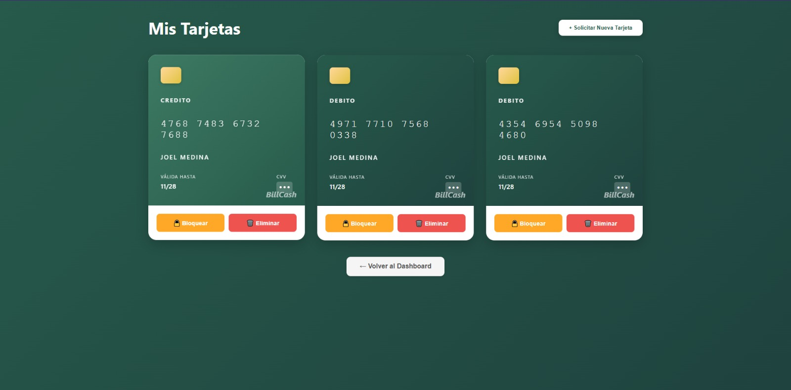

======================
Gestión de Tarjetas
======================

Administra tus tarjetas de pago
================================

BillCash te permite vincular y administrar múltiples tarjetas de débito y crédito 
para facilitar tus transacciones.

|

Tus Tarjetas Vinculadas
========================

En la pantalla de "Mis Tarjetas" puedes ver:

* **Tipo de tarjeta:** CRÉDITO o DÉBITO
* **Número de tarjeta:** Los últimos 4 dígitos (formato enmascarado)
* **Titular:** Nombre del propietario de la tarjeta
* **Fecha de vencimiento:** Válida hasta (mes/año)
* **CVV:** Código de seguridad (oculto por seguridad)

Acciones Disponibles
====================

Para cada tarjeta puedes:

🔒 **Bloquear**
   Temporalmente deshabilita la tarjeta para transacciones
   
   * Haz clic en el botón naranja "🔓 Bloquear"
   * La tarjeta quedará inactiva hasta que la desbloquees
   * Útil si sospechas de actividad no autorizada

🗑️ **Eliminar**
   Elimina permanentemente la tarjeta de tu cuenta
   
   * Haz clic en el botón rojo "🗑️ Eliminar"
   * Confirma la eliminación
   * Esta acción no se puede deshacer

➕ **Solicitar Nueva Tarjeta**
   Agrega una nueva tarjeta a tu billetera
   
   * Haz clic en el botón verde "+ Solicitar Nueva Tarjeta"
   * Completa los datos de la tarjeta
   * Verifica la información y confirma

Agregar una Nueva Tarjeta
==========================

Pasos para vincular una tarjeta:

1. **Haz clic en "+ Solicitar Nueva Tarjeta"**
   
   Se abrirá un formulario de registro

2. **Completa los datos:**
   
   * Número de tarjeta (16 dígitos)
   * Nombre del titular (como aparece en la tarjeta)
   * Fecha de vencimiento (MM/AA)
   * CVV (3 o 4 dígitos en el reverso)
   * Tipo de tarjeta (Crédito o Débito)

3. **Verifica la información**
   
   Asegúrate de que todos los datos sean correctos

4. **Confirma**
   
   Tu tarjeta será validada y agregada a tu cuenta

Seguridad de las Tarjetas
==========================

🔐 **Protección de Datos**
   * Todos los datos se almacenan encriptados
   * El CVV nunca se muestra después del registro
   * Cumplimos con estándares PCI-DSS

🛡️ **Detección de Fraude**
   * Monitoreo automático de transacciones sospechosas
   * Notificaciones de actividad inusual
   * Bloqueo automático ante intentos no autorizados

💳 **Mejores Prácticas**
   * No compartas tu CVV con nadie
   * Bloquea tarjetas que no uses frecuentemente
   * Revisa regularmente tus transacciones
   * Actualiza tarjetas vencidas

Volver al Dashboard
====================

Para regresar al panel principal:

* Haz clic en el botón "← Volver al Dashboard"
* También puedes usar el menú de navegación superior

----

.. tip::
   **Recomendación:** Mantén al menos una tarjeta activa para facilitar 
   tus transacciones en BillCash.

.. warning::
   **Importante:** Al eliminar una tarjeta, perderás el historial asociado 
   a esa tarjeta. Descarga tus reportes antes de eliminarla.
