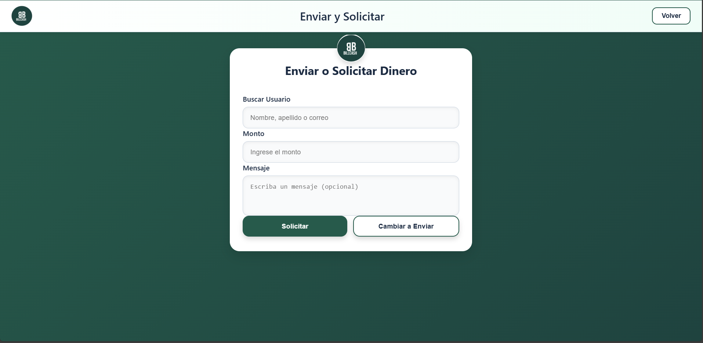

==============================
Manual de Usuario - BillCash
==============================

.. note::
   Este manual describe el uso de la aplicación BillCash v1.0.0

Introducción
============

**BillCash** es una aplicación móvil/web para gestión de transacciones de dinero entre usuarios. 
Este manual te guiará paso a paso en el uso de todas las funcionalidades del sistema.

Requisitos Previos
==================

**Para usar BillCash necesitas:**

* Conexión a internet estable
* Navegador web moderno (Chrome, Firefox, Safari, Edge) o aplicación móvil
* Correo electrónico válido
* Número de teléfono (máximo 10 dígitos)

Características del Sistema
============================

* ✅ Interfaz moderna y fácil de usar
* 🌙 Modo oscuro disponible
* 💰 Envío y solicitud de dinero en tiempo real
* � Cartera digital con historial completo
* 📊 Dashboard con estadísticas en tiempo real
* 🔒 Seguridad con encriptación de contraseñas
* 📱 Diseño responsive (adaptable a móviles y tablets)
* 🔔 Notificaciones instantáneas

----

1. Registro de Usuario
=======================

Cómo crear tu cuenta en BillCash
---------------------------------

La pantalla de registro te permite crear una nueva cuenta en el sistema.

.. image:: _static/registro.png
   :width: 800px
   :align: center
   :alt: Pantalla de Registro

|

**Pasos para registrarte:**

1. **Accede a la aplicación**
   
   Abre BillCash en tu navegador o aplicación móvil.

2. **Haz clic en "Registro"**
   
   En la pantalla de inicio, selecciona la opción de registro.

3. **Completa el formulario**
   
   Llena los siguientes campos obligatorios:
   
   * **Nombres:** Tu(s) nombre(s) completo(s)
   * **Apellidos:** Tus apellidos completos
   * **Correo:** Tu dirección de correo electrónico (será tu usuario)
   * **Teléfono:** Tu número telefónico (solo números, máximo 10 dígitos)
   * **Contraseña:** Crea una contraseña segura (se mostrará como puntos)

4. **Revisa el progreso**
   
   En la parte inferior verás una barra de progreso indicando "40% completado".

5. **Haz clic en "Iniciar sesión"**
   
   Una vez completado el formulario, presiona el botón azul oscuro.

**Validaciones importantes:**

.. warning::
   * El correo debe ser único (no puede estar registrado previamente)
   * El teléfono debe contener solo números, máximo 10 dígitos
   * La contraseña debe ser segura
   * Todos los campos son obligatorios

**Elementos adicionales:**

* **Logo BillCash:** En el panel derecho se muestra el logo de la aplicación
* **Modo Oscuro:** Botón disponible para cambiar el tema visual

----

2. Iniciar Sesión
=================

Cómo acceder a tu cuenta
-------------------------

Una vez registrado, puedes iniciar sesión para acceder a todas las funcionalidades.

.. image:: _static/login.png
   :width: 800px
   :align: center
   :alt: Pantalla de Inicio de Sesión

|

**Pasos para iniciar sesión:**

1. **Accede a la pantalla de inicio**
   
   Si ya tienes cuenta, haz clic en "Inicio" en el menú superior derecho.

2. **Ingresa tus credenciales**
   
   * **Correo:** Escribe el correo electrónico con el que te registraste
   * **Contraseña:** Ingresa tu contraseña (se mostrará oculta)

3. **Haz clic en "Ingresar"**
   
   Presiona el botón verde para acceder al sistema.

4. **Acceso exitoso**
   
   Serás redirigido al dashboard principal de la aplicación.

**Características de seguridad:**

* 🔒 Las contraseñas se muestran ocultas por seguridad
* ⏱️ Las sesiones expiran después de 30 minutos de inactividad
* 🔐 Validación de credenciales en tiempo real

**¿Olvidaste tu contraseña?**

.. note::
   Si olvidaste tu contraseña, puedes recuperarla mediante el enlace 
   "¿Olvidaste tu contraseña?" (funcionalidad en desarrollo).

**Opciones de tema:**

El botón "🌙 Modo Oscuro" te permite cambiar entre tema claro y oscuro para mayor comodidad visual.

----

3. Enviar Dinero
================

Cómo transferir dinero a otros usuarios
----------------------------------------

La función principal de BillCash es enviar dinero de forma rápida y segura.

.. image:: _static/enviar_dinero.png
   :width: 800px
   :align: center
   :alt: Pantalla de Enviar Dinero

|

**Pasos para enviar dinero:**

1. **Accede a "Enviar y Solicitar"**
   
   Desde el menú principal, selecciona la opción de transacciones.

2. **Completa el formulario de envío**
   
   * **Buscar Usuario:** Escribe el nombre, apellido o correo del destinatario
   * **Monto:** Ingresa la cantidad de dinero que deseas enviar
   * **Mensaje:** (Opcional) Agrega un mensaje o nota sobre el envío

3. **Verifica los datos**
   
   Asegúrate de que el usuario destinatario y el monto sean correctos.

4. **Haz clic en "Enviar"**
   
   El botón verde procesará la transacción.

**Funcionalidades adicionales:**

* **Cambiar a Solicitar:** Si deseas solicitar dinero en lugar de enviarlo, 
  haz clic en el botón blanco "Cambiar a Solicitar"
* **Volver:** Botón en la esquina superior derecha para regresar al menú principal

**Validaciones del sistema:**

.. warning::
   * El destinatario debe existir en el sistema
   * Debes tener saldo suficiente para realizar el envío
   * El monto debe ser mayor a cero
   * La transacción quedará en estado "Pendiente" hasta su aprobación

**Estados de la transacción:**

1. **Pendiente:** Transacción creada, esperando validación
2. **En Proceso:** El sistema está procesando la transferencia
3. **Completada:** Dinero transferido exitosamente
4. **Cancelada:** Transacción cancelada por el usuario o sistema

----

4. Solicitar Dinero
===================

Cómo solicitar dinero a otros usuarios
---------------------------------------

Además de enviar, puedes solicitar dinero a otros usuarios del sistema.

|

**Pasos para solicitar dinero:**

1. **Cambia al modo "Solicitar"**
   
   Si estás en la pantalla de "Enviar", haz clic en "Cambiar a Solicitar".
   Los botones cambiarán: "Solicitar" (verde) y "Cambiar a Enviar" (blanco).

2. **Completa el formulario**
   
   * **Buscar Usuario:** Escribe el nombre, apellido o correo de quien solicitas dinero
   * **Monto:** Ingresa la cantidad que deseas solicitar
   * **Mensaje:** (Opcional) Explica el motivo de tu solicitud

3. **Haz clic en "Solicitar"**
   
   El botón verde enviará la solicitud al usuario.

**Diferencias entre Enviar y Solicitar:**

.. list-table::
   :header-rows: 1
   :widths: 40 60

   * - Enviar Dinero
     - Solicitar Dinero
   * - Requieres tener saldo
     - No requieres saldo
   * - Tú inicias la transacción
     - El otro usuario debe aprobar
   * - El dinero se transfiere de inmediato
     - Queda pendiente hasta aprobación

**Notificaciones:**

El usuario solicitado recibirá una notificación sobre tu solicitud y podrá:

* ✅ Aprobar la solicitud (enviará el dinero)
* ❌ Rechazar la solicitud
* ⏸️ Ignorar la solicitud (expirará después de 24 horas)

----

5. Home (Dashboard Principal)
==============================

Panel de control de tu cuenta
------------------------------

El Home o Dashboard es la pantalla principal donde puedes ver un resumen de tu cuenta y acceder rápidamente a todas las funcionalidades.

.. image:: _static/home.png
   :width: 800px
   :align: center
   :alt: Pantalla Principal (Home)

|

**Elementos del Dashboard:**

Una vez que inicies sesión, verás:

1. **Información de cuenta**
   
   * Nombre de usuario
   * Saldo disponible
   * Avatar o foto de perfil

2. **Acceso rápido a funciones**
   
   * 💸 Enviar dinero
   * 💰 Solicitar dinero
   * 👛 Ver cartera (transacciones)
   * ⚙️ Configuración

3. **Resumen de actividad reciente**
   
   * Últimas transacciones
   * Notificaciones pendientes
   * Solicitudes de dinero recibidas

4. **Estadísticas visuales**
   
   * Gráficos de ingresos y egresos
   * Balance del mes
   * Comparativas

**Acciones disponibles desde el Home:**

* **Ver saldo:** Tu balance actual se muestra destacado en la parte superior
* **Notificaciones:** Ícono de campana con contador de alertas
* **Menú de usuario:** Acceso a perfil y configuración
* **Modo oscuro:** Cambio rápido de tema visual

----

6. Cartera (Transacciones)
===========================

Cómo consultar tu historial de transacciones
---------------------------------------------

La Cartera te permite ver todas tus transacciones realizadas y gestionar tu dinero.

.. image:: _static/cartera.png
   :width: 800px
   :align: center
   :alt: Pantalla de Cartera

|

**Acceso a la Cartera:**

1. **Haz clic en "Cartera"**
   
   Desde el menú principal o el dashboard, selecciona la opción de cartera.

2. **Espera la carga**
   
   El sistema consultará tu historial. Verás el mensaje "Cargando..." 
   mientras se obtienen los datos.

**Información mostrada:**

Para cada transacción verás:

* **Tipo:** Envío, Solicitud, Recepción
* **Usuario:** Con quién realizaste la transacción
* **Monto:** Cantidad de dinero
* **Fecha y hora:** Cuándo se realizó
* **Estado:** Pendiente, Completada, Cancelada
* **Mensaje:** Nota asociada (si existe)

**Filtros disponibles:**

Puedes filtrar las transacciones por:

* **Fecha:** Selecciona un rango de fechas
* **Tipo:** Envíos, Recepciones, Solicitudes
* **Estado:** Todas, Pendientes, Completadas, Canceladas

**Saldo y balance:**

En la parte superior de la Cartera verás:

* **Saldo actual:** Dinero disponible en tu cuenta
* **Saldo total:** Incluyendo dinero en transacciones pendientes
* **Balance del mes:** Resumen de ingresos y egresos

**Acciones disponibles:**

Desde esta pantalla puedes:

* 👁️ Ver detalles completos de una transacción
* ❌ Cancelar transacciones pendientes
* 📄 Exportar tu historial (PDF, Excel)
* 🔍 Buscar transacciones específicas
* 💳 Recargar saldo
* 🏦 Retirar dinero

**Estados de transacciones:**

.. list-table::
   :header-rows: 1
   :widths: 20 80

   * - Estado
     - Descripción
   * - 🟡 Pendiente
     - Transacción creada, esperando procesamiento
   * - 🔵 En Proceso
     - El sistema está validando la transacción
   * - 🟢 Completada
     - Transacción exitosa, dinero transferido
   * - 🔴 Cancelada
     - Transacción cancelada por usuario o sistema
   * - ⚠️ Error
     - Ocurrió un error, contacta soporte

**Botón Volver:**

En la esquina superior derecha encontrarás el botón "Volver" para regresar 
al menú principal.

----

Preguntas Frecuentes (FAQ)
===========================

Registro y Cuenta
-----------------

**¿Puedo cambiar mi correo después de registrarme?**

No, el correo electrónico es tu identificador único. Si necesitas cambiarlo, 
contacta a soporte.

**¿Puedo tener múltiples cuentas?**

No, cada correo y teléfono solo puede tener una cuenta asociada.

**¿Cómo cambio mi contraseña?**

Desde el menú de perfil > Configuración > Cambiar contraseña.

Transacciones
-------------

**¿Cuál es el monto mínimo para enviar?**

El monto mínimo es $1.00 (un peso/dólar).

**¿Hay límite máximo de envío?**

Sí, el límite diario es de $10,000.00 por motivos de seguridad.

**¿Puedo cancelar un envío?**

Solo puedes cancelar transacciones en estado "Pendiente" o "En Proceso".

**¿Cuánto tarda una transferencia?**

Las transferencias se procesan en tiempo real, generalmente en menos de 1 minuto.

Seguridad
---------

**¿Es seguro BillCash?**

Sí, utilizamos encriptación de datos, tokens JWT y cumplimos con estándares 
de seguridad bancaria.

**¿Qué hago si detecto una transacción no autorizada?**

Contacta inmediatamente a soporte a través del botón de "Ayuda" o escribe a 
soporte@billcash.com.

**¿Puedo recuperar mi contraseña?**

Sí, usa la opción "¿Olvidaste tu contraseña?" en la pantalla de inicio de sesión.

----

Solución de Problemas
======================

No puedo iniciar sesión
------------------------

**Posibles causas y soluciones:**

1. **Credenciales incorrectas**
   
   * Verifica que el correo esté escrito correctamente
   * Asegúrate de usar la contraseña correcta
   * Usa la opción de recuperación de contraseña si es necesario

2. **Cuenta no verificada**
   
   * Revisa tu correo electrónico
   * Busca el email de verificación de BillCash
   * Haz clic en el enlace de confirmación

3. **Cuenta bloqueada**
   
   * Después de 5 intentos fallidos, la cuenta se bloquea temporalmente
   * Espera 30 minutos o usa recuperación de contraseña

Error al enviar dinero
----------------------

**Mensaje: "Saldo insuficiente"**

Verifica que tengas saldo disponible en tu cuenta. Puedes solicitar dinero 
o hacer una recarga.

**Mensaje: "Usuario no encontrado"**

Asegúrate de escribir correctamente el nombre, apellido o correo del destinatario.

**Mensaje: "Error de conexión"**

Verifica tu conexión a internet y vuelve a intentarlo.

La página no carga
------------------

1. **Actualiza la página:** Presiona F5 o Ctrl+R
2. **Limpia caché:** Borra el caché de tu navegador
3. **Prueba otro navegador:** Chrome, Firefox o Edge
4. **Verifica tu conexión:** Asegúrate de tener internet estable

----

Contacto y Soporte
==================

¿Necesitas ayuda adicional?
----------------------------

**Email de soporte:**
soporte@billcash.com

**Horario de atención:**
Lunes a Viernes: 8:00 AM - 8:00 PM
Sábados: 9:00 AM - 2:00 PM

**Chat en vivo:**
Disponible en la aplicación (botón de ayuda 💬)

**Centro de ayuda:**
https://ayuda.billcash.com

**Redes sociales:**

* Twitter: @BillCashApp
* Facebook: /BillCashOficial
* Instagram: @billcash_oficial

----

Actualizaciones del Manual
===========================

**Versión actual:** 1.0.0

**Última actualización:** Octubre 2025

**Registro de cambios:**

* v1.0.0 (Oct 2025) - Manual inicial con funcionalidades base

----

Términos y Condiciones
======================

Al usar BillCash, aceptas:

* Los Términos y Condiciones de Uso
* La Política de Privacidad
* El Aviso de Privacidad

Puedes consultar estos documentos en: https://www.billcash.com/legal

----

Volver a la documentación
==========================

* :doc:`index` - Página principal
* :doc:`casos_uso` - Casos de uso del sistema

----

**© 2025 BillCash - Todos los derechos reservados**
